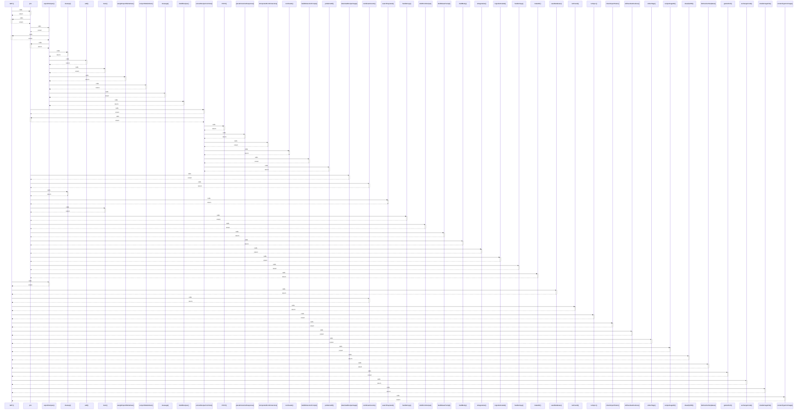

# GET()

> God node · 20 connections · [C:\Users\ThinkPad\Documents\Claude\Dashboard\web\src\app\api\sync\calendar\route.ts](file:///C:/Users/ThinkPad/Documents/Claude/Dashboard/web/src/app/api/sync/calendar/route.ts#L31)

## Call Trace Diagram

## Connections by Relation

### calls
- [[join]] `INFERRED`
- [[exportRecipes()]] `INFERRED`
- [[seedDatabase()]] `INFERRED`
- [[combineAmounts()]] `INFERRED`
- [[notFound()]] `EXTRACTED`
- [[runSync()]] `EXTRACTED`
- [[checkImportToken()]] `INFERRED`
- [[rollOverdueRoutines()]] `INFERRED`
- [[collectTags()]] `INFERRED`
- [[recipeImageDir()]] `INFERRED`
- [[classifyShift()]] `INFERRED`
- [[listRoutineTemplates()]] `INFERRED`
- [[getAuthUrl()]] `INFERRED`
- [[exchangeCode()]] `INFERRED`
- [[isSafeImageFile()]] `INFERRED`
- [[contentTypeForImage()]] `INFERRED`

### contains
- [[route.ts]] `EXTRACTED`
- [[route.ts]] `EXTRACTED`
- [[route.ts]] `EXTRACTED`
- [[route.ts]] `EXTRACTED`

---

*Part of the graphify knowledge wiki. See [[index]] to navigate.*