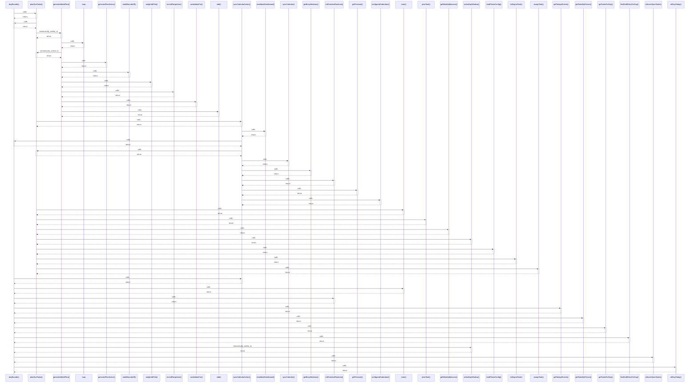

# dayBounds()

> God node · 12 connections · [C:\Users\ThinkPad\Documents\Claude\Dashboard\web\src\lib\dates.ts](file:///C:/Users/ThinkPad/Documents/Claude/Dashboard/web/src/lib/dates.ts#L11)

## Call Trace Diagram

## Connections by Relation

### calls
- [[planDueTasks()]] `INFERRED`
- [[syncCalendarAction()]] `INFERRED`
- [[main()]] `INFERRED`
- [[rollOverdueRoutines()]] `INFERRED`
- [[getTodaysEvents()]] `INFERRED`
- [[getTasksByPerson()]] `INFERRED`
- [[getTasksForDay()]] `INFERRED`
- [[findDraftEntryForDay()]] `INFERRED`
- [[rolloverOpenTasks()]] `INFERRED`
- [[allDayToday()]] `INFERRED`

### contains
- [[dates.ts]] `EXTRACTED`

### semantically_similar_to
- [[activeDayWindow()]] `INFERRED`

---

*Part of the graphify knowledge wiki. See [[index]] to navigate.*