# filter

> God node · 33 connections · [C:\Users\ThinkPad\Documents\Claude\Dashboard\web\src\lib\recipeFilterParams.test.ts](file:///C:/Users/ThinkPad/Documents/Claude/Dashboard/web/src/lib/recipeFilterParams.test.ts#L72)

## Call Trace Diagram

```mermaid
sequenceDiagram
    participant P0 as filter
    participant P1 as toImportedRecipe()
    participant P2 as map
    participant P3 as upsertImportedRecipe()
    participant P4 as combineAmounts()
    participant P5 as parseExtractionResponse()
    participant P6 as toImportedFromExtraction()
    participant P7 as generateRecipeIdeasAction()
    participant P8 as getDraftMealPlan()
    participant P9 as toRecipe()
    participant P10 as ingredientRows()
    participant P11 as configuredCalendars()
    participant P12 as splitSteps()
    participant P13 as draftToInput()
    participant P14 as collectSteps()
    participant P15 as collectTags()
    participant P16 as getWeekMealPlan()
    participant P17 as recipeIdeaToImported()
    participant P18 as searchHaystack()
    participant P19 as collectTags()
    participant P20 as main()
    participant P21 as handleCopy()
    participant P22 as parseEventTime()
    participant P23 as allValues()
    participant P24 as coveredMs()
    participant P25 as fromLocalDateKey()
    participant P26 as getTodaysEvents()
    participant P27 as replaceWindowEvents()
    participant P28 as listRecipes()
    participant P29 as listRecipeOptions()
    participant P30 as listRecipeTags()
    participant P31 as getTasksByPerson()
    participant P32 as getTasksForDay()
    participant P33 as weightedPick()
    participant P34 as draftFromRecipe()
    participant P35 as buildIdeasPrompt()
    participant P36 as parseIdeasResponse()
    participant P37 as recipeToMarkdown()
    participant P38 as buildBody()
    participant P39 as isVegetarian()
    participant P40 as handleCopy()
    participant P41 as toMinutes()
    participant P42 as listAllRecipes()
    participant P43 as listOpenTasks()
    participant P44 as deleteRoutineTemplate()
    participant P45 as buildChoreTasks()
    participant P46 as coerceIdea()
    participant P47 as MobileNavBar()
    participant P48 as scaleIngredients()
    participant P49 as importRecipeFromUrl()
    participant P50 as stripHtml()
    participant P51 as slugFromName()
    participant P52 as pickImageUrl()
    participant P53 as parseIsoDuration()
    participant P54 as parseNutritionNumber()
    participant P55 as parseServings()
    participant P56 as getBusyWindows()
    participant P57 as planTask()
    participant P58 as checkWeather()
    participant P59 as main()
    participant P60 as matchesQuery()
    participant P61 as recommendClothing()
    participant P62 as listRoutineTemplates()
    participant P63 as parseTags()
    participant P64 as ingredientLabel()
    participant P65 as filterByAvailability()
    participant P66 as dayLoad()
    participant P67 as filterByPerson()
    participant P68 as parseStepsJson()
    participant P69 as learnedInterval()
    participant P70 as applyFilters()
    participant P71 as TodayView()
    participant P72 as toggleTag()
    participant P73 as getActiveProjectProgress()
    participant P74 as mdFiles()
    P0->>+ P1: calls
    P1-->>- P0: return
    P1->>+ P2: calls
    P2-->>- P1: return
    P2->>+ P1: calls
    P1-->>- P2: return
    P2->>+ P3: calls
    P3-->>- P2: return
    P2->>+ P4: calls
    P4-->>- P2: return
    P2->>+ P5: calls
    P5-->>- P2: return
    P2->>+ P6: calls
    P6-->>- P2: return
    P2->>+ P7: calls
    P7-->>- P2: return
    P2->>+ P8: calls
    P8-->>- P2: return
    P2->>+ P9: calls
    P9-->>- P2: return
    P2->>+ P10: calls
    P10-->>- P2: return
    P2->>+ P11: calls
    P11-->>- P2: return
    P2->>+ P12: calls
    P12-->>- P2: return
    P2->>+ P13: calls
    P13-->>- P2: return
    P2->>+ P14: calls
    P14-->>- P2: return
    P2->>+ P15: calls
    P15-->>- P2: return
    P2->>+ P16: calls
    P16-->>- P2: return
    P2->>+ P17: calls
    P17-->>- P2: return
    P2->>+ P18: calls
    P18-->>- P2: return
    P2->>+ P19: calls
    P19-->>- P2: return
    P2->>+ P20: calls
    P20-->>- P2: return
    P2->>+ P21: calls
    P21-->>- P2: return
    P2->>+ P22: calls
    P22-->>- P2: return
    P2->>+ P23: calls
    P23-->>- P2: return
    P2->>+ P24: calls
    P24-->>- P2: return
    P2->>+ P25: calls
    P25-->>- P2: return
    P2->>+ P26: calls
    P26-->>- P2: return
    P2->>+ P27: calls
    P27-->>- P2: return
    P2->>+ P28: calls
    P28-->>- P2: return
    P2->>+ P29: calls
    P29-->>- P2: return
    P2->>+ P30: calls
    P30-->>- P2: return
    P2->>+ P31: calls
    P31-->>- P2: return
    P2->>+ P32: calls
    P32-->>- P2: return
    P2->>+ P33: calls
    P33-->>- P2: return
    P2->>+ P34: calls
    P34-->>- P2: return
    P2->>+ P35: calls
    P35-->>- P2: return
    P2->>+ P36: calls
    P36-->>- P2: return
    P2->>+ P37: calls
    P37-->>- P2: return
    P2->>+ P38: calls
    P38-->>- P2: return
    P2->>+ P39: calls
    P39-->>- P2: return
    P2->>+ P40: calls
    P40-->>- P2: return
    P2->>+ P41: calls
    P41-->>- P2: return
    P2->>+ P42: calls
    P42-->>- P2: return
    P2->>+ P43: calls
    P43-->>- P2: return
    P2->>+ P44: calls
    P44-->>- P2: return
    P2->>+ P45: calls
    P45-->>- P2: return
    P2->>+ P46: calls
    P46-->>- P2: return
    P2->>+ P47: calls
    P47-->>- P2: return
    P2->>+ P48: calls
    P48-->>- P2: return
    P1->>+ P0: calls
    P0-->>- P1: return
    P1->>+ P49: calls
    P49-->>- P1: return
    P1->>+ P50: calls
    P50-->>- P1: return
    P1->>+ P15: calls
    P15-->>- P1: return
    P1->>+ P51: calls
    P51-->>- P1: return
    P1->>+ P14: calls
    P14-->>- P1: return
    P1->>+ P52: calls
    P52-->>- P1: return
    P1->>+ P53: calls
    P53-->>- P1: return
    P1->>+ P54: calls
    P54-->>- P1: return
    P1->>+ P55: calls
    P55-->>- P1: return
    P0->>+ P56: calls
    P56-->>- P0: return
    P0->>+ P57: calls
    P57-->>- P0: return
    P0->>+ P4: calls
    P4-->>- P0: return
    P0->>+ P5: calls
    P5-->>- P0: return
    P0->>+ P58: calls
    P58-->>- P0: return
    P0->>+ P10: calls
    P10-->>- P0: return
    P0->>+ P11: calls
    P11-->>- P0: return
    P0->>+ P12: calls
    P12-->>- P0: return
    P0->>+ P13: calls
    P13-->>- P0: return
    P0->>+ P14: calls
    P14-->>- P0: return
    P0->>+ P59: calls
    P59-->>- P0: return
    P0->>+ P60: calls
    P60-->>- P0: return
    P0->>+ P21: calls
    P21-->>- P0: return
    P0->>+ P23: calls
    P23-->>- P0: return
    P0->>+ P61: calls
    P61-->>- P0: return
    P0->>+ P24: calls
    P24-->>- P0: return
    P0->>+ P62: calls
    P62-->>- P0: return
    P0->>+ P63: calls
    P63-->>- P0: return
    P0->>+ P36: calls
    P36-->>- P0: return
    P0->>+ P64: calls
    P64-->>- P0: return
    P0->>+ P65: calls
    P65-->>- P0: return
    P0->>+ P66: calls
    P66-->>- P0: return
    P0->>+ P67: calls
    P67-->>- P0: return
    P0->>+ P68: calls
    P68-->>- P0: return
    P0->>+ P69: calls
    P69-->>- P0: return
    P0->>+ P46: calls
    P46-->>- P0: return
    P0->>+ P70: calls
    P70-->>- P0: return
    P0->>+ P71: calls
    P71-->>- P0: return
    P0->>+ P72: calls
    P72-->>- P0: return
    P0->>+ P73: calls
    P73-->>- P0: return
    P0->>+ P74: calls
    P74-->>- P0: return
```

## Connections by Relation

### calls
- [[toImportedRecipe()]] `INFERRED`
- [[getBusyWindows()]] `INFERRED`
- [[planTask()]] `INFERRED`
- [[combineAmounts()]] `INFERRED`
- [[parseExtractionResponse()]] `INFERRED`
- [[checkWeather()]] `INFERRED`
- [[ingredientRows()]] `INFERRED`
- [[configuredCalendars()]] `INFERRED`
- [[splitSteps()]] `INFERRED`
- [[draftToInput()]] `INFERRED`
- [[collectSteps()]] `INFERRED`
- [[main()]] `INFERRED`
- [[matchesQuery()]] `INFERRED`
- [[handleCopy()]] `INFERRED`
- [[allValues()]] `INFERRED`
- [[recommendClothing()]] `INFERRED`
- [[coveredMs()]] `INFERRED`
- [[listRoutineTemplates()]] `INFERRED`
- [[parseTags()]] `INFERRED`
- [[parseIdeasResponse()]] `INFERRED`

### contains
- [[recipeFilterParams.test.ts]] `EXTRACTED`

---

*Part of the graphify knowledge wiki. See [[index]] to navigate.*