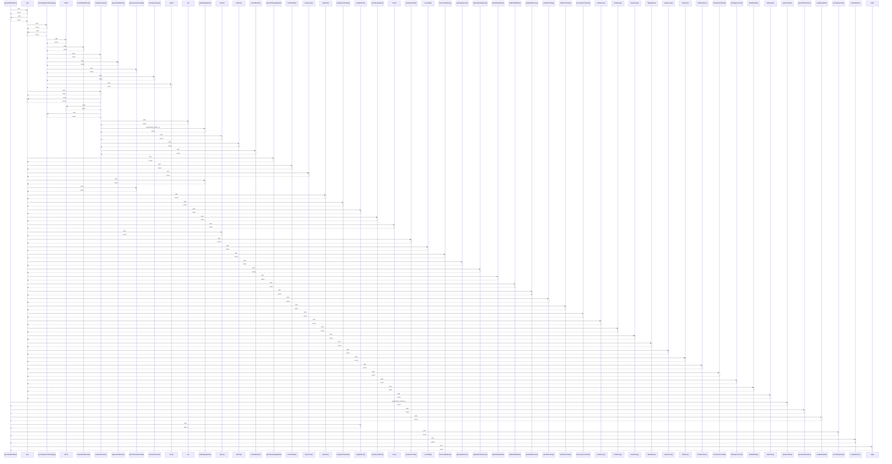

# generateWeekPlan()

> God node · 10 connections · [C:\Users\ThinkPad\Documents\Claude\Dashboard\web\src\lib\services\mealPlanner.ts](file:///C:/Users/ThinkPad/Documents/Claude/Dashboard/web/src/lib/services/mealPlanner.ts#L78)

## Call Trace Diagram

## Connections by Relation

### calls
- [[map]] `INFERRED`
- [[generatePlanAction()]] `INFERRED`
- [[weekBoundsOf()]] `INFERRED`
- [[weightedPick()]] `INFERRED`
- [[recentRecipeUse()]] `INFERRED`
- [[candidatesFor()]] `EXTRACTED`
- [[add()]] `INFERRED`

### conceptually_related_to
- [[rerollDraftDay()]] `INFERRED`

### contains
- [[mealPlanner.ts]] `EXTRACTED`

### semantically_similar_to
- [[planDueTasks()]] `INFERRED`

---

*Part of the graphify knowledge wiki. See [[index]] to navigate.*