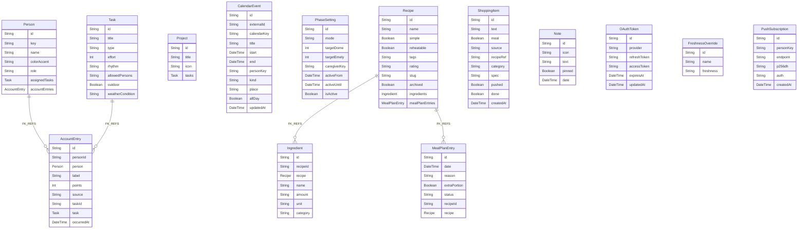

# Knowledge Graph Index

> Auto-generated by graphify. Start here — read community articles for context, then drill into god nodes for detail.

**1202 nodes · 1257 edges · 207 communities**

---

## System Architecture Flowchart

```mermaid
flowchart TD
    C0["Shopping Freshness (95 nodes)"]
    C1["Schedule Engine (68 nodes)"]
    C2["Community 2 (60 nodes)"]
    C3["Community 3 (52 nodes)"]
    C4["Community 4 (44 nodes)"]
    C5["Community 5 (40 nodes)"]
    C6["Community 6 (35 nodes)"]
    C7["Community 7 (33 nodes)"]
    C8["Community 8 (31 nodes)"]
    C9["Community 9 (30 nodes)"]
    C10["Community 10 (26 nodes)"]
    C11["Community 11 (25 nodes)"]
    C12["Community 12 (24 nodes)"]
    C13["Community 13 (24 nodes)"]
    C14["Community 14 (20 nodes)"]
    C15["Community 15 (19 nodes)"]
    C16["Community 16 (19 nodes)"]
    C17["Community 17 (17 nodes)"]
    C18["Community 18 (15 nodes)"]
    C19["Community 19 (13 nodes)"]
    C20["Community 20 (12 nodes)"]
    C21["Community 21 (12 nodes)"]
    C22["Community 22 (11 nodes)"]
    C23["Community 23 (10 nodes)"]
    C24["Community 24 (10 nodes)"]
    C25["Community 25 (10 nodes)"]
    C26["Community 26 (10 nodes)"]
    C27["Community 27 (9 nodes)"]
    C28["Pet Care Scheduler (9 nodes)"]
    C29["App Configuration (9 nodes)"]
    C30["Community 30 (9 nodes)"]
    C31["Clothing UV Advisor (9 nodes)"]
    C32["Community 32 (8 nodes)"]
    C33["Community 33 (8 nodes)"]
    C34["Community 34 (8 nodes)"]
    C35["Community 35 (7 nodes)"]
    C36["Community 36 (7 nodes)"]
    C37["Community 37 (7 nodes)"]
    C38["Community 38 (7 nodes)"]
    C39["Community 39 (7 nodes)"]
    C40["Community 40 (6 nodes)"]
    C41["Community 41 (6 nodes)"]
    C42["Community 42 (6 nodes)"]
    C43["Community 43 (6 nodes)"]
    C44["Community 44 (6 nodes)"]
    C45["Community 45 (6 nodes)"]
    C46["Community 46 (6 nodes)"]
    C47["Community 47 (6 nodes)"]
    C48["Community 48 (5 nodes)"]
    C49["Community 49 (5 nodes)"]
    C50["Community 50 (5 nodes)"]
    C51["Community 51 (5 nodes)"]
    C52["Community 52 (5 nodes)"]
    C53["Community 53 (5 nodes)"]
    C54["Community 54 (5 nodes)"]
    C55["Client Notes (5 nodes)"]
    C56["Community 56 (5 nodes)"]
    C57["Community 57 (5 nodes)"]
    C58["Community 58 (5 nodes)"]
    C59["Community 59 (4 nodes)"]
    C60["Community 60 (4 nodes)"]
    C61["Community 61 (4 nodes)"]
    C62["Community 62 (4 nodes)"]
    C63["ORM Layer (4 nodes)"]
    C64["Community 64 (4 nodes)"]
    C65["Community 65 (4 nodes)"]
    C66["Community 66 (4 nodes)"]
    C67["Community 67 (4 nodes)"]
    C68["Community 68 (4 nodes)"]
    C69["Community 69 (3 nodes)"]
    C70["Community 70 (3 nodes)"]
    C71["Community 71 (3 nodes)"]
    C72["Community 72 (3 nodes)"]
    C73["unknown (3 nodes)"]
    C74["Community 74 (3 nodes)"]
    C75["Community 75 (3 nodes)"]
    C76["Community 76 (3 nodes)"]
    C77["Project Lifecycle (3 nodes)"]
    C78["Community 78 (3 nodes)"]
    C79["Community 79 (3 nodes)"]
    C80["Community 80 (2 nodes)"]
    C81["Linting config (2 nodes)"]
    C82["Next.js config (2 nodes)"]
    C83["Configuration Management (2 nodes)"]
    C84["unknown (2 nodes)"]
    C85["Community 85 (2 nodes)"]
    C86["unknown (2 nodes)"]
    C87["unknown (2 nodes)"]
    C88["unknown (2 nodes)"]
    C89["unknown (2 nodes)"]
    C90["unknown (2 nodes)"]
    C91["unknown (2 nodes)"]
    C92["unknown (2 nodes)"]
    C93["Database Client (2 nodes)"]
    C94["Result Handling (2 nodes)"]
    C95["Calendar API Tests (2 nodes)"]
    C96["Community 96 (2 nodes)"]
    C97["Community 97 (2 nodes)"]
    C98["Community 98 (2 nodes)"]
    C99["Community 99 (2 nodes)"]
    C100["Community 100 (2 nodes)"]
    C101["unknown (2 nodes)"]
    C102["Community 102 (2 nodes)"]
    C103["Community 103 (2 nodes)"]
    C104["Community 104 (2 nodes)"]
    C105["Community 105 (2 nodes)"]
    C106["Community 106 (2 nodes)"]
    C107["Community 107 (2 nodes)"]
    C108["Community 108 (2 nodes)"]
    C109["Community 109 (2 nodes)"]
    C110["Community 110 (1 nodes)"]
    C111["unknown (1 nodes)"]
    C112["unknown (1 nodes)"]
    C113["unknown (1 nodes)"]
    C114["unknown (1 nodes)"]
    C115["unknown (1 nodes)"]
    C116["unknown (1 nodes)"]
    C117["unknown (1 nodes)"]
    C118["unknown (1 nodes)"]
    C119["unknown (1 nodes)"]
    C120["unknown (1 nodes)"]
    C121["unknown (1 nodes)"]
    C122["unknown (1 nodes)"]
    C123["unknown (1 nodes)"]
    C124["unknown (1 nodes)"]
    C125["unknown (1 nodes)"]
    C126["unknown (1 nodes)"]
    C127["unknown (1 nodes)"]
    C128["unknown (1 nodes)"]
    C129["unknown (1 nodes)"]
    C130["unknown (1 nodes)"]
    C131["unknown (1 nodes)"]
    C132["unknown (1 nodes)"]
    C133["unknown (1 nodes)"]
    C134["unknown (1 nodes)"]
    C135["unknown (1 nodes)"]
    C136["unknown (1 nodes)"]
    C137["unknown (1 nodes)"]
    C138["unknown (1 nodes)"]
    C139["unknown (1 nodes)"]
    C140["unknown (1 nodes)"]
    C141["unknown (1 nodes)"]
    C142["VPN tunneling (1 nodes)"]
    C143["Community 143 (1 nodes)"]
    C144["Community 144 (1 nodes)"]
    C145["Community 145 (1 nodes)"]
    C146["Community 146 (1 nodes)"]
    C147["Community 147 (1 nodes)"]
    C148["Community 148 (1 nodes)"]
    C149["Community 149 (1 nodes)"]
    C150["Community 150 (1 nodes)"]
    C151["Community 151 (1 nodes)"]
    C152["Community 152 (1 nodes)"]
    C153["Web App Manifest (1 nodes)"]
    C154["Community 154 (1 nodes)"]
    C155["Service Worker Security (1 nodes)"]
    C156["Offline Page (1 nodes)"]
    C157["Process Visibility (1 nodes)"]
    C158["Community 158 (1 nodes)"]
    C159["Community 159 (1 nodes)"]
    C160["Community 160 (1 nodes)"]
    C161["Community 161 (1 nodes)"]
    C162["Community 162 (1 nodes)"]
    C163["Community 163 (1 nodes)"]
    C164["Community 164 (1 nodes)"]
    C165["Community 165 (1 nodes)"]
    C166["Community 166 (1 nodes)"]
    C167["Community 167 (1 nodes)"]
    C168["Community 168 (1 nodes)"]
    C169["Community 169 (1 nodes)"]
    C170["Community 170 (1 nodes)"]
    C171["Community 171 (1 nodes)"]
    C172["Community 172 (1 nodes)"]
    C173["Community 173 (1 nodes)"]
    C174["Community 174 (1 nodes)"]
    C175["Community 175 (1 nodes)"]
    C176["Community 176 (1 nodes)"]
    C177["Community 177 (1 nodes)"]
    C178["Community 178 (1 nodes)"]
    C179["Community 179 (1 nodes)"]
    C180["Community 180 (1 nodes)"]
    C181["Community 181 (1 nodes)"]
    C182["Community 182 (1 nodes)"]
    C183["Community 183 (1 nodes)"]
    C184["Community 184 (1 nodes)"]
    C185["Community 185 (1 nodes)"]
    C186["Community 186 (1 nodes)"]
    C187["Community 187 (1 nodes)"]
    C188["Community 188 (1 nodes)"]
    C189["Community 189 (1 nodes)"]
    C190["Community 190 (1 nodes)"]
    C191["Booking Status (1 nodes)"]
    C192["Community 192 (1 nodes)"]
    C193["Community 193 (1 nodes)"]
    C194["Meal Plan Lifecycle (1 nodes)"]
    C195["Community 195 (1 nodes)"]
    C196["Community 196 (1 nodes)"]
    C197["Community 197 (1 nodes)"]
    C198["Community 198 (1 nodes)"]
    C199["Community 199 (1 nodes)"]
    C200["Calendar Events (1 nodes)"]
    C201["Phase Configuration (1 nodes)"]
    C202["Community 202 (1 nodes)"]
    C203["Community 203 (1 nodes)"]
    C204["OAuth Token (1 nodes)"]
    C205["Community 205 (1 nodes)"]
    C206["Push Notification (1 nodes)"]
    C2 -->|10 edges| C1
    C1 -->|10 edges| C0
    C0 -->|9 edges| C1
    C3 -->|6 edges| C0
    C3 -->|4 edges| C5
    C5 -->|4 edges| C0
    C0 -->|4 edges| C3
    C3 -->|4 edges| C2
    C2 -->|3 edges| C3
    C3 -->|3 edges| C1
    C3 -->|3 edges| C7
    C7 -->|3 edges| C0
    C0 -->|3 edges| C9
    C0 -->|3 edges| C2
    C0 -->|2 edges| C20
    C7 -->|2 edges| C3
    C7 -->|2 edges| C1
    C7 -->|2 edges| C5
    C3 -->|1 edges| C9
    C9 -->|1 edges| C7
    C9 -->|1 edges| C1
    C1 -->|1 edges| C20
    C1 -->|1 edges| C9
    C20 -->|1 edges| C1
    C6 -->|1 edges| C0
    C0 -->|1 edges| C4
    C7 -->|1 edges| C13
    C14 -->|1 edges| C3
    C1 -->|1 edges| C7
    C8 -->|1 edges| C0
    C0 -->|1 edges| C7
    C1 -->|1 edges| C3
    C37 -->|1 edges| C1
    C20 -->|1 edges| C7
    C2 -->|1 edges| C9
    C5 -->|1 edges| C7
    C2 -->|1 edges| C0
    C9 -->|1 edges| C0
    C4 -->|1 edges| C1
    C4 -->|1 edges| C0
    C2 -->|1 edges| C13
```

## Database Schema (ERD)

## Communities
(sorted by size, largest first)

- [[Shopping Freshness]] — 95 nodes
- [[Schedule Engine]] — 68 nodes
- [[Community 2]] — 60 nodes
- [[Community 3]] — 52 nodes
- [[Community 4]] — 44 nodes
- [[Community 5]] — 40 nodes
- [[Community 6]] — 35 nodes
- [[Community 7]] — 33 nodes
- [[Community 8]] — 31 nodes
- [[Community 9]] — 30 nodes
- [[Community 10]] — 26 nodes
- [[Community 11]] — 25 nodes
- [[Community 12]] — 24 nodes
- [[Community 13]] — 24 nodes
- [[Community 14]] — 20 nodes
- [[Community 15]] — 19 nodes
- [[Community 16]] — 19 nodes
- [[Community 17]] — 17 nodes
- [[Community 18]] — 15 nodes
- [[Community 19]] — 13 nodes
- [[Community 20]] — 12 nodes
- [[Community 21]] — 12 nodes
- [[Community 22]] — 11 nodes
- [[Community 23]] — 10 nodes
- [[Community 24]] — 10 nodes
- [[Community 25]] — 10 nodes
- [[Community 26]] — 10 nodes
- [[Community 27]] — 9 nodes
- [[Pet Care Scheduler]] — 9 nodes
- [[App Configuration]] — 9 nodes
- [[Community 30]] — 9 nodes
- [[Clothing UV Advisor]] — 9 nodes
- [[Community 32]] — 8 nodes
- [[Community 33]] — 8 nodes
- [[Community 34]] — 8 nodes
- [[Community 35]] — 7 nodes
- [[Community 36]] — 7 nodes
- [[Community 37]] — 7 nodes
- [[Community 38]] — 7 nodes
- [[Community 39]] — 7 nodes
- [[Community 40]] — 6 nodes
- [[Community 41]] — 6 nodes
- [[Community 42]] — 6 nodes
- [[Community 43]] — 6 nodes
- [[Community 44]] — 6 nodes
- [[Community 45]] — 6 nodes
- [[Community 46]] — 6 nodes
- [[Community 47]] — 6 nodes
- [[Community 48]] — 5 nodes
- [[Community 49]] — 5 nodes
- [[Community 50]] — 5 nodes
- [[Community 51]] — 5 nodes
- [[Community 52]] — 5 nodes
- [[Community 53]] — 5 nodes
- [[Community 54]] — 5 nodes
- [[Client Notes]] — 5 nodes
- [[Community 56]] — 5 nodes
- [[Community 57]] — 5 nodes
- [[Community 58]] — 5 nodes
- [[Community 59]] — 4 nodes
- [[Community 60]] — 4 nodes
- [[Community 61]] — 4 nodes
- [[Community 62]] — 4 nodes
- [[ORM Layer]] — 4 nodes
- [[Community 64]] — 4 nodes
- [[Community 65]] — 4 nodes
- [[Community 66]] — 4 nodes
- [[Community 67]] — 4 nodes
- [[Community 68]] — 4 nodes
- [[Community 69]] — 3 nodes
- [[Community 70]] — 3 nodes
- [[Community 71]] — 3 nodes
- [[Community 72]] — 3 nodes
- [[unknown]] — 3 nodes
- [[Community 74]] — 3 nodes
- [[Community 75]] — 3 nodes
- [[Community 76]] — 3 nodes
- [[Project Lifecycle]] — 3 nodes
- [[Community 78]] — 3 nodes
- [[Community 79]] — 3 nodes
- [[Community 80]] — 2 nodes
- [[Linting config]] — 2 nodes
- [[Next.js config]] — 2 nodes
- [[Configuration Management]] — 2 nodes
- [[unknown]] — 2 nodes
- [[Community 85]] — 2 nodes
- [[unknown]] — 2 nodes
- [[unknown]] — 2 nodes
- [[unknown]] — 2 nodes
- [[unknown]] — 2 nodes
- [[unknown]] — 2 nodes
- [[unknown]] — 2 nodes
- [[unknown]] — 2 nodes
- [[Database Client]] — 2 nodes
- [[Result Handling]] — 2 nodes
- [[Calendar API Tests]] — 2 nodes
- [[Community 96]] — 2 nodes
- [[Community 97]] — 2 nodes
- [[Community 98]] — 2 nodes
- [[Community 99]] — 2 nodes
- [[Community 100]] — 2 nodes
- [[unknown]] — 2 nodes
- [[Community 102]] — 2 nodes
- [[Community 103]] — 2 nodes
- [[Community 104]] — 2 nodes
- [[Community 105]] — 2 nodes
- [[Community 106]] — 2 nodes
- [[Community 107]] — 2 nodes
- [[Community 108]] — 2 nodes
- [[Community 109]] — 2 nodes
- [[Community 110]] — 1 nodes
- [[unknown]] — 1 nodes
- [[unknown]] — 1 nodes
- [[unknown]] — 1 nodes
- [[unknown]] — 1 nodes
- [[unknown]] — 1 nodes
- [[unknown]] — 1 nodes
- [[unknown]] — 1 nodes
- [[unknown]] — 1 nodes
- [[unknown]] — 1 nodes
- [[unknown]] — 1 nodes
- [[unknown]] — 1 nodes
- [[unknown]] — 1 nodes
- [[unknown]] — 1 nodes
- [[unknown]] — 1 nodes
- [[unknown]] — 1 nodes
- [[unknown]] — 1 nodes
- [[unknown]] — 1 nodes
- [[unknown]] — 1 nodes
- [[unknown]] — 1 nodes
- [[unknown]] — 1 nodes
- [[unknown]] — 1 nodes
- [[unknown]] — 1 nodes
- [[unknown]] — 1 nodes
- [[unknown]] — 1 nodes
- [[unknown]] — 1 nodes
- [[unknown]] — 1 nodes
- [[unknown]] — 1 nodes
- [[unknown]] — 1 nodes
- [[unknown]] — 1 nodes
- [[unknown]] — 1 nodes
- [[unknown]] — 1 nodes
- [[VPN tunneling]] — 1 nodes
- [[Community 143]] — 1 nodes
- [[Community 144]] — 1 nodes
- [[Community 145]] — 1 nodes
- [[Community 146]] — 1 nodes
- [[Community 147]] — 1 nodes
- [[Community 148]] — 1 nodes
- [[Community 149]] — 1 nodes
- [[Community 150]] — 1 nodes
- [[Community 151]] — 1 nodes
- [[Community 152]] — 1 nodes
- [[Web App Manifest]] — 1 nodes
- [[Community 154]] — 1 nodes
- [[Service Worker Security]] — 1 nodes
- [[Offline Page]] — 1 nodes
- [[Process Visibility]] — 1 nodes
- [[Community 158]] — 1 nodes
- [[Community 159]] — 1 nodes
- [[Community 160]] — 1 nodes
- [[Community 161]] — 1 nodes
- [[Community 162]] — 1 nodes
- [[Community 163]] — 1 nodes
- [[Community 164]] — 1 nodes
- [[Community 165]] — 1 nodes
- [[Community 166]] — 1 nodes
- [[Community 167]] — 1 nodes
- [[Community 168]] — 1 nodes
- [[Community 169]] — 1 nodes
- [[Community 170]] — 1 nodes
- [[Community 171]] — 1 nodes
- [[Community 172]] — 1 nodes
- [[Community 173]] — 1 nodes
- [[Community 174]] — 1 nodes
- [[Community 175]] — 1 nodes
- [[Community 176]] — 1 nodes
- [[Community 177]] — 1 nodes
- [[Community 178]] — 1 nodes
- [[Community 179]] — 1 nodes
- [[Community 180]] — 1 nodes
- [[Community 181]] — 1 nodes
- [[Community 182]] — 1 nodes
- [[Community 183]] — 1 nodes
- [[Community 184]] — 1 nodes
- [[Community 185]] — 1 nodes
- [[Community 186]] — 1 nodes
- [[Community 187]] — 1 nodes
- [[Community 188]] — 1 nodes
- [[Community 189]] — 1 nodes
- [[Community 190]] — 1 nodes
- [[Booking Status]] — 1 nodes
- [[Community 192]] — 1 nodes
- [[Community 193]] — 1 nodes
- [[Meal Plan Lifecycle]] — 1 nodes
- [[Community 195]] — 1 nodes
- [[Community 196]] — 1 nodes
- [[Community 197]] — 1 nodes
- [[Community 198]] — 1 nodes
- [[Community 199]] — 1 nodes
- [[Calendar Events]] — 1 nodes
- [[Phase Configuration]] — 1 nodes
- [[Community 202]] — 1 nodes
- [[Community 203]] — 1 nodes
- [[OAuth Token]] — 1 nodes
- [[Community 205]] — 1 nodes
- [[Push Notification]] — 1 nodes

## God Nodes
(most connected concepts — the load-bearing abstractions)

- [[map]] — 37 connections
- [[revalidateDashboard()]] — 25 connections
- [[GET()]] — 12 connections
- [[dayBounds()]] — 12 connections
- [[rerollDraftDay()]] — 11 connections
- [[planDueTasks()]] — 11 connections
- [[currentWeekBounds()]] — 10 connections
- [[generateWeekPlan()]] — 10 connections
- [[syncIngredientsToShopping()]] — 10 connections
- [[syncCalendarAction()]] — 9 connections

---

*Generated by [graphify](https://github.com/safishamsi/graphify)*