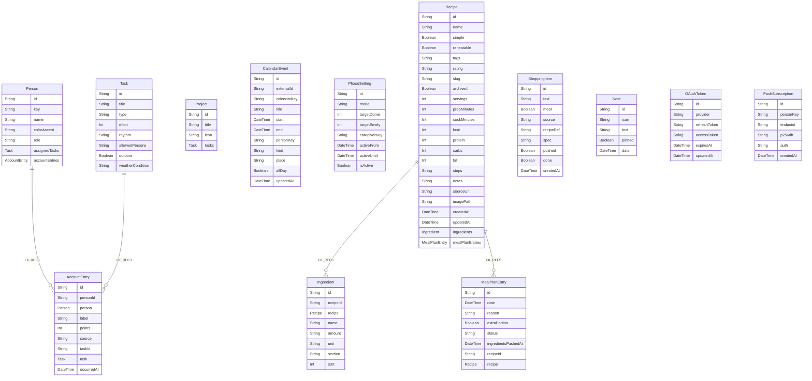

# Knowledge Graph Index

> Auto-generated by graphify. Start here — read community articles for context, then drill into god nodes for detail.

**2013 nodes · 2223 edges · 223 communities**

---

## System Architecture Flowchart

```mermaid
flowchart TD
    C0["Shopping Freshness (153 nodes)"]
    C1["Schedule Engine (118 nodes)"]
    C2["Community 2 (117 nodes)"]
    C3["Community 3 (115 nodes)"]
    C4["Community 4 (82 nodes)"]
    C5["Community 5 (81 nodes)"]
    C6["Community 6 (72 nodes)"]
    C7["Community 7 (68 nodes)"]
    C8["Community 8 (49 nodes)"]
    C9["Community 9 (36 nodes)"]
    C10["Community 10 (36 nodes)"]
    C11["Community 11 (33 nodes)"]
    C12["Community 12 (33 nodes)"]
    C13["Community 13 (33 nodes)"]
    C14["Community 14 (29 nodes)"]
    C15["Community 15 (28 nodes)"]
    C16["Community 16 (25 nodes)"]
    C17["Community 17 (25 nodes)"]
    C18["Community 18 (24 nodes)"]
    C19["Community 19 (24 nodes)"]
    C20["Community 20 (23 nodes)"]
    C21["Community 21 (23 nodes)"]
    C22["Community 22 (23 nodes)"]
    C23["Community 23 (20 nodes)"]
    C24["Community 24 (19 nodes)"]
    C25["Community 25 (19 nodes)"]
    C26["Community 26 (18 nodes)"]
    C27["Community 27 (17 nodes)"]
    C28["Pet Care Scheduler (17 nodes)"]
    C29["App Configuration (17 nodes)"]
    C30["Community 30 (16 nodes)"]
    C31["Clothing UV Advisor (16 nodes)"]
    C32["Community 32 (15 nodes)"]
    C33["Community 33 (14 nodes)"]
    C34["Community 34 (14 nodes)"]
    C35["Community 35 (14 nodes)"]
    C36["Community 36 (13 nodes)"]
    C37["Community 37 (13 nodes)"]
    C38["Community 38 (13 nodes)"]
    C39["Community 39 (12 nodes)"]
    C40["Community 40 (12 nodes)"]
    C41["Community 41 (12 nodes)"]
    C42["Community 42 (12 nodes)"]
    C43["Community 43 (12 nodes)"]
    C44["Community 44 (12 nodes)"]
    C45["Community 45 (12 nodes)"]
    C46["Community 46 (11 nodes)"]
    C47["Community 47 (11 nodes)"]
    C48["Community 48 (11 nodes)"]
    C49["Community 49 (11 nodes)"]
    C50["Community 50 (11 nodes)"]
    C51["Community 51 (11 nodes)"]
    C52["Community 52 (11 nodes)"]
    C53["Community 53 (10 nodes)"]
    C54["Community 54 (10 nodes)"]
    C55["Client Notes (10 nodes)"]
    C56["Community 56 (10 nodes)"]
    C57["Community 57 (10 nodes)"]
    C58["Community 58 (9 nodes)"]
    C59["Community 59 (9 nodes)"]
    C60["Community 60 (9 nodes)"]
    C61["Community 61 (9 nodes)"]
    C62["Community 62 (8 nodes)"]
    C63["ORM Layer (8 nodes)"]
    C64["Community 64 (7 nodes)"]
    C65["Community 65 (7 nodes)"]
    C66["Community 66 (7 nodes)"]
    C67["Community 67 (7 nodes)"]
    C68["Community 68 (7 nodes)"]
    C69["Community 69 (6 nodes)"]
    C70["Community 70 (5 nodes)"]
    C71["Community 71 (5 nodes)"]
    C72["Community 72 (4 nodes)"]
    C73["unknown (4 nodes)"]
    C74["Community 74 (3 nodes)"]
    C75["Community 75 (3 nodes)"]
    C76["Community 76 (3 nodes)"]
    C77["Project Lifecycle (3 nodes)"]
    C78["Community 78 (3 nodes)"]
    C79["Community 79 (3 nodes)"]
    C80["Community 80 (3 nodes)"]
    C81["Linting config (2 nodes)"]
    C82["Next.js config (2 nodes)"]
    C83["Configuration Management (2 nodes)"]
    C84["unknown (2 nodes)"]
    C85["Community 85 (2 nodes)"]
    C86["unknown (2 nodes)"]
    C87["unknown (2 nodes)"]
    C88["unknown (2 nodes)"]
    C89["unknown (2 nodes)"]
    C90["unknown (2 nodes)"]
    C91["unknown (1 nodes)"]
    C92["unknown (1 nodes)"]
    C93["Database Client (1 nodes)"]
    C94["Result Handling (1 nodes)"]
    C95["Calendar API Tests (1 nodes)"]
    C96["Community 96 (1 nodes)"]
    C97["Community 97 (1 nodes)"]
    C98["Community 98 (1 nodes)"]
    C99["Community 99 (1 nodes)"]
    C100["Community 100 (1 nodes)"]
    C101["unknown (1 nodes)"]
    C102["Community 102 (1 nodes)"]
    C103["Community 103 (1 nodes)"]
    C104["Community 104 (1 nodes)"]
    C105["Community 105 (1 nodes)"]
    C106["Community 106 (1 nodes)"]
    C107["Community 107 (1 nodes)"]
    C108["Community 108 (1 nodes)"]
    C109["Community 109 (1 nodes)"]
    C110["Community 110 (1 nodes)"]
    C111["unknown (1 nodes)"]
    C112["unknown (1 nodes)"]
    C113["unknown (1 nodes)"]
    C114["unknown (1 nodes)"]
    C115["unknown (1 nodes)"]
    C116["unknown (1 nodes)"]
    C117["unknown (1 nodes)"]
    C118["unknown (1 nodes)"]
    C119["unknown (1 nodes)"]
    C120["unknown (1 nodes)"]
    C121["unknown (1 nodes)"]
    C122["unknown (1 nodes)"]
    C123["unknown (1 nodes)"]
    C124["unknown (1 nodes)"]
    C125["unknown (1 nodes)"]
    C126["unknown (1 nodes)"]
    C127["unknown (1 nodes)"]
    C128["unknown (1 nodes)"]
    C129["unknown (1 nodes)"]
    C130["unknown (1 nodes)"]
    C131["unknown (1 nodes)"]
    C132["unknown (1 nodes)"]
    C133["unknown (1 nodes)"]
    C134["unknown (1 nodes)"]
    C135["unknown (1 nodes)"]
    C136["unknown (1 nodes)"]
    C137["unknown (1 nodes)"]
    C138["unknown (1 nodes)"]
    C139["unknown (1 nodes)"]
    C140["unknown (1 nodes)"]
    C141["unknown (1 nodes)"]
    C142["VPN tunneling (1 nodes)"]
    C143["Community 143 (1 nodes)"]
    C144["Community 144 (1 nodes)"]
    C145["Community 145 (1 nodes)"]
    C146["Community 146 (1 nodes)"]
    C147["Community 147 (1 nodes)"]
    C148["Community 148 (1 nodes)"]
    C149["Community 149 (1 nodes)"]
    C150["Community 150 (1 nodes)"]
    C151["Community 151 (1 nodes)"]
    C152["Community 152 (1 nodes)"]
    C153["Web App Manifest (1 nodes)"]
    C154["Community 154 (1 nodes)"]
    C155["Service Worker Security (1 nodes)"]
    C156["Offline Page (1 nodes)"]
    C157["Process Visibility (1 nodes)"]
    C158["Community 158 (1 nodes)"]
    C159["Community 159 (1 nodes)"]
    C160["Community 160 (1 nodes)"]
    C161["Community 161 (1 nodes)"]
    C162["Community 162 (1 nodes)"]
    C163["Community 163 (1 nodes)"]
    C164["Community 164 (1 nodes)"]
    C165["Community 165 (1 nodes)"]
    C166["Community 166 (1 nodes)"]
    C167["Community 167 (1 nodes)"]
    C168["Community 168 (1 nodes)"]
    C169["Community 169 (1 nodes)"]
    C170["Community 170 (1 nodes)"]
    C171["Community 171 (1 nodes)"]
    C172["Community 172 (1 nodes)"]
    C173["Community 173 (1 nodes)"]
    C174["Community 174 (1 nodes)"]
    C175["Community 175 (1 nodes)"]
    C176["Community 176 (1 nodes)"]
    C177["Community 177 (1 nodes)"]
    C178["Community 178 (1 nodes)"]
    C179["Community 179 (1 nodes)"]
    C180["Community 180 (1 nodes)"]
    C181["Community 181 (1 nodes)"]
    C182["Community 182 (1 nodes)"]
    C183["Community 183 (1 nodes)"]
    C184["Community 184 (1 nodes)"]
    C185["Community 185 (1 nodes)"]
    C186["Community 186 (1 nodes)"]
    C187["Community 187 (1 nodes)"]
    C188["Community 188 (1 nodes)"]
    C189["Community 189 (1 nodes)"]
    C190["Community 190 (1 nodes)"]
    C191["Booking Status (1 nodes)"]
    C192["Community 192 (1 nodes)"]
    C193["Community 193 (1 nodes)"]
    C194["Meal Plan Lifecycle (1 nodes)"]
    C195["Community 195 (1 nodes)"]
    C196["Community 196 (1 nodes)"]
    C197["Community 197 (1 nodes)"]
    C198["Community 198 (1 nodes)"]
    C199["Community 199 (1 nodes)"]
    C200["Calendar Events (1 nodes)"]
    C201["Phase Configuration (1 nodes)"]
    C202["Community 202 (1 nodes)"]
    C203["Community 203 (1 nodes)"]
    C204["OAuth Token (1 nodes)"]
    C205["Community 205 (1 nodes)"]
    C206["Push Notification (1 nodes)"]
    C207["Community 207 (1 nodes)"]
    C208["Community 208 (1 nodes)"]
    C209["Community 209 (1 nodes)"]
    C210["Community 210 (1 nodes)"]
    C211["Community 211 (1 nodes)"]
    C212["Community 212 (1 nodes)"]
    C213["Community 213 (1 nodes)"]
    C214["Community 214 (1 nodes)"]
    C215["Community 215 (1 nodes)"]
    C216["Community 216 (1 nodes)"]
    C217["Community 217 (1 nodes)"]
    C218["Community 218 (1 nodes)"]
    C219["Community 219 (1 nodes)"]
    C220["Community 220 (1 nodes)"]
    C221["Community 221 (1 nodes)"]
    C222["Community 222 (1 nodes)"]
    C2 -->|17 edges| C1
    C1 -->|9 edges| C2
    C5 -->|8 edges| C1
    C1 -->|6 edges| C4
    C1 -->|6 edges| C5
    C6 -->|5 edges| C4
    C1 -->|5 edges| C6
    C6 -->|4 edges| C2
    C2 -->|4 edges| C6
    C6 -->|4 edges| C1
    C2 -->|4 edges| C4
    C1 -->|4 edges| C18
    C4 -->|4 edges| C6
    C1 -->|4 edges| C15
    C2 -->|3 edges| C5
    C3 -->|3 edges| C1
    C1 -->|3 edges| C50
    C4 -->|2 edges| C1
    C4 -->|2 edges| C8
    C39 -->|2 edges| C0
    C18 -->|2 edges| C3
    C11 -->|2 edges| C3
    C5 -->|2 edges| C15
    C0 -->|2 edges| C1
    C5 -->|2 edges| C0
    C8 -->|2 edges| C6
    C8 -->|2 edges| C1
    C8 -->|2 edges| C2
    C15 -->|2 edges| C1
    C2 -->|2 edges| C0
    C2 -->|1 edges| C3
    C3 -->|1 edges| C2
    C2 -->|1 edges| C50
    C2 -->|1 edges| C15
    C1 -->|1 edges| C3
    C5 -->|1 edges| C3
    C18 -->|1 edges| C8
    C11 -->|1 edges| C8
    C5 -->|1 edges| C50
    C5 -->|1 edges| C2
    C1 -->|1 edges| C8
    C18 -->|1 edges| C1
    C2 -->|1 edges| C9
    C60 -->|1 edges| C0
    C4 -->|1 edges| C0
    C6 -->|1 edges| C0
    C4 -->|1 edges| C2
    C48 -->|1 edges| C0
    C12 -->|1 edges| C0
    C12 -->|1 edges| C1
    C1 -->|1 edges| C49
    C16 -->|1 edges| C0
    C16 -->|1 edges| C2
    C21 -->|1 edges| C0
    C26 -->|1 edges| C0
    C8 -->|1 edges| C4
    C30 -->|1 edges| C0
    C30 -->|1 edges| C1
    C46 -->|1 edges| C0
    C46 -->|1 edges| C2
    C49 -->|1 edges| C4
    C19 -->|1 edges| C0
    C17 -->|1 edges| C0
    C40 -->|1 edges| C0
    C62 -->|1 edges| C0
    C62 -->|1 edges| C1
    C9 -->|1 edges| C0
    C10 -->|1 edges| C13
```

## Database Schema (ERD)

```mermaid
erDiagram
    Person {
        String id
        String key
        String name
        String colorAccent
        String role
        Task assignedTasks
        AccountEntry accountEntries
    }
    Task {
        String id
        String title
        String type
        Int effort
        String rhythm
        String allowedPersons
        Boolean outdoor
        String weatherCondition
    }
    Project {
        String id
        String title
        String icon
        Task tasks
    }
    CalendarEvent {
        String id
        String externalId
        String calendarKey
        String title
        DateTime start
        DateTime end
        String personKey
        String kind
        String place
        Boolean allDay
        DateTime updatedAt
    }
    AccountEntry {
        String id
        String personId
        Person person
        String label
        Int points
        String source
        String taskId
        Task task
        DateTime occurredAt
    }
    PhaseSetting {
        String id
        String mode
        Int targetDome
        Int targetEmely
        String caregiverKey
        DateTime activeFrom
        DateTime activeUntil
        Boolean isActive
    }
    Recipe {
        String id
        String name
        Boolean simple
        Boolean reheatable
        String tags
        String rating
        String slug
        Boolean archived
        Int servings
        Int prepMinutes
        Int cookMinutes
        Int kcal
        Int protein
        Int carbs
        Int fat
        String steps
        String notes
        String sourceUrl
        String imagePath
        DateTime createdAt
        DateTime updatedAt
        Ingredient ingredients
        MealPlanEntry mealPlanEntries
    }
    Ingredient {
        String id
        String recipeId
        Recipe recipe
        String name
        String amount
        String unit
        String section
        Int sort
    }
    MealPlanEntry {
        String id
        DateTime date
        String reason
        Boolean extraPortion
        String status
        DateTime ingredientsPushedAt
        String recipeId
        Recipe recipe
    }
    ShoppingItem {
        String id
        String text
        Boolean meal
        String source
        String recipeRef
        String spec
        Boolean pushed
        Boolean done
        DateTime createdAt
    }
    Note {
        String id
        String icon
        String text
        Boolean pinned
        DateTime date
    }
    OAuthToken {
        String id
        String provider
        String refreshToken
        String accessToken
        DateTime expiresAt
        DateTime updatedAt
    }
    PushSubscription {
        String id
        String personKey
        String endpoint
        String p256dh
        String auth
        DateTime createdAt
    }
    Person ||--o{ AccountEntry : "FK_REFS"
    Task ||--o{ AccountEntry : "FK_REFS"
    Recipe ||--o{ Ingredient : "FK_REFS"
    Recipe ||--o{ MealPlanEntry : "FK_REFS"
```

## Communities
(sorted by size, largest first)

- [[Shopping Freshness]] — 153 nodes
- [[Schedule Engine]] — 118 nodes
- [[Community 2]] — 117 nodes
- [[Community 3]] — 115 nodes
- [[Community 4]] — 82 nodes
- [[Community 5]] — 81 nodes
- [[Community 6]] — 72 nodes
- [[Community 7]] — 68 nodes
- [[Community 8]] — 49 nodes
- [[Community 9]] — 36 nodes
- [[Community 10]] — 36 nodes
- [[Community 11]] — 33 nodes
- [[Community 12]] — 33 nodes
- [[Community 13]] — 33 nodes
- [[Community 14]] — 29 nodes
- [[Community 15]] — 28 nodes
- [[Community 16]] — 25 nodes
- [[Community 17]] — 25 nodes
- [[Community 18]] — 24 nodes
- [[Community 19]] — 24 nodes
- [[Community 20]] — 23 nodes
- [[Community 21]] — 23 nodes
- [[Community 22]] — 23 nodes
- [[Community 23]] — 20 nodes
- [[Community 24]] — 19 nodes
- [[Community 25]] — 19 nodes
- [[Community 26]] — 18 nodes
- [[Community 27]] — 17 nodes
- [[Pet Care Scheduler]] — 17 nodes
- [[App Configuration]] — 17 nodes
- [[Community 30]] — 16 nodes
- [[Clothing UV Advisor]] — 16 nodes
- [[Community 32]] — 15 nodes
- [[Community 33]] — 14 nodes
- [[Community 34]] — 14 nodes
- [[Community 35]] — 14 nodes
- [[Community 36]] — 13 nodes
- [[Community 37]] — 13 nodes
- [[Community 38]] — 13 nodes
- [[Community 39]] — 12 nodes
- [[Community 40]] — 12 nodes
- [[Community 41]] — 12 nodes
- [[Community 42]] — 12 nodes
- [[Community 43]] — 12 nodes
- [[Community 44]] — 12 nodes
- [[Community 45]] — 12 nodes
- [[Community 46]] — 11 nodes
- [[Community 47]] — 11 nodes
- [[Community 48]] — 11 nodes
- [[Community 49]] — 11 nodes
- [[Community 50]] — 11 nodes
- [[Community 51]] — 11 nodes
- [[Community 52]] — 11 nodes
- [[Community 53]] — 10 nodes
- [[Community 54]] — 10 nodes
- [[Client Notes]] — 10 nodes
- [[Community 56]] — 10 nodes
- [[Community 57]] — 10 nodes
- [[Community 58]] — 9 nodes
- [[Community 59]] — 9 nodes
- [[Community 60]] — 9 nodes
- [[Community 61]] — 9 nodes
- [[Community 62]] — 8 nodes
- [[ORM Layer]] — 8 nodes
- [[Community 64]] — 7 nodes
- [[Community 65]] — 7 nodes
- [[Community 66]] — 7 nodes
- [[Community 67]] — 7 nodes
- [[Community 68]] — 7 nodes
- [[Community 69]] — 6 nodes
- [[Community 70]] — 5 nodes
- [[Community 71]] — 5 nodes
- [[Community 72]] — 4 nodes
- [[unknown]] — 4 nodes
- [[Community 74]] — 3 nodes
- [[Community 75]] — 3 nodes
- [[Community 76]] — 3 nodes
- [[Project Lifecycle]] — 3 nodes
- [[Community 78]] — 3 nodes
- [[Community 79]] — 3 nodes
- [[Community 80]] — 3 nodes
- [[Linting config]] — 2 nodes
- [[Next.js config]] — 2 nodes
- [[Configuration Management]] — 2 nodes
- [[unknown]] — 2 nodes
- [[Community 85]] — 2 nodes
- [[unknown]] — 2 nodes
- [[unknown]] — 2 nodes
- [[unknown]] — 2 nodes
- [[unknown]] — 2 nodes
- [[unknown]] — 2 nodes
- [[unknown]] — 1 nodes
- [[unknown]] — 1 nodes
- [[Database Client]] — 1 nodes
- [[Result Handling]] — 1 nodes
- [[Calendar API Tests]] — 1 nodes
- [[Community 96]] — 1 nodes
- [[Community 97]] — 1 nodes
- [[Community 98]] — 1 nodes
- [[Community 99]] — 1 nodes
- [[Community 100]] — 1 nodes
- [[unknown]] — 1 nodes
- [[Community 102]] — 1 nodes
- [[Community 103]] — 1 nodes
- [[Community 104]] — 1 nodes
- [[Community 105]] — 1 nodes
- [[Community 106]] — 1 nodes
- [[Community 107]] — 1 nodes
- [[Community 108]] — 1 nodes
- [[Community 109]] — 1 nodes
- [[Community 110]] — 1 nodes
- [[unknown]] — 1 nodes
- [[unknown]] — 1 nodes
- [[unknown]] — 1 nodes
- [[unknown]] — 1 nodes
- [[unknown]] — 1 nodes
- [[unknown]] — 1 nodes
- [[unknown]] — 1 nodes
- [[unknown]] — 1 nodes
- [[unknown]] — 1 nodes
- [[unknown]] — 1 nodes
- [[unknown]] — 1 nodes
- [[unknown]] — 1 nodes
- [[unknown]] — 1 nodes
- [[unknown]] — 1 nodes
- [[unknown]] — 1 nodes
- [[unknown]] — 1 nodes
- [[unknown]] — 1 nodes
- [[unknown]] — 1 nodes
- [[unknown]] — 1 nodes
- [[unknown]] — 1 nodes
- [[unknown]] — 1 nodes
- [[unknown]] — 1 nodes
- [[unknown]] — 1 nodes
- [[unknown]] — 1 nodes
- [[unknown]] — 1 nodes
- [[unknown]] — 1 nodes
- [[unknown]] — 1 nodes
- [[unknown]] — 1 nodes
- [[unknown]] — 1 nodes
- [[unknown]] — 1 nodes
- [[unknown]] — 1 nodes
- [[VPN tunneling]] — 1 nodes
- [[Community 143]] — 1 nodes
- [[Community 144]] — 1 nodes
- [[Community 145]] — 1 nodes
- [[Community 146]] — 1 nodes
- [[Community 147]] — 1 nodes
- [[Community 148]] — 1 nodes
- [[Community 149]] — 1 nodes
- [[Community 150]] — 1 nodes
- [[Community 151]] — 1 nodes
- [[Community 152]] — 1 nodes
- [[Web App Manifest]] — 1 nodes
- [[Community 154]] — 1 nodes
- [[Service Worker Security]] — 1 nodes
- [[Offline Page]] — 1 nodes
- [[Process Visibility]] — 1 nodes
- [[Community 158]] — 1 nodes
- [[Community 159]] — 1 nodes
- [[Community 160]] — 1 nodes
- [[Community 161]] — 1 nodes
- [[Community 162]] — 1 nodes
- [[Community 163]] — 1 nodes
- [[Community 164]] — 1 nodes
- [[Community 165]] — 1 nodes
- [[Community 166]] — 1 nodes
- [[Community 167]] — 1 nodes
- [[Community 168]] — 1 nodes
- [[Community 169]] — 1 nodes
- [[Community 170]] — 1 nodes
- [[Community 171]] — 1 nodes
- [[Community 172]] — 1 nodes
- [[Community 173]] — 1 nodes
- [[Community 174]] — 1 nodes
- [[Community 175]] — 1 nodes
- [[Community 176]] — 1 nodes
- [[Community 177]] — 1 nodes
- [[Community 178]] — 1 nodes
- [[Community 179]] — 1 nodes
- [[Community 180]] — 1 nodes
- [[Community 181]] — 1 nodes
- [[Community 182]] — 1 nodes
- [[Community 183]] — 1 nodes
- [[Community 184]] — 1 nodes
- [[Community 185]] — 1 nodes
- [[Community 186]] — 1 nodes
- [[Community 187]] — 1 nodes
- [[Community 188]] — 1 nodes
- [[Community 189]] — 1 nodes
- [[Community 190]] — 1 nodes
- [[Booking Status]] — 1 nodes
- [[Community 192]] — 1 nodes
- [[Community 193]] — 1 nodes
- [[Meal Plan Lifecycle]] — 1 nodes
- [[Community 195]] — 1 nodes
- [[Community 196]] — 1 nodes
- [[Community 197]] — 1 nodes
- [[Community 198]] — 1 nodes
- [[Community 199]] — 1 nodes
- [[Calendar Events]] — 1 nodes
- [[Phase Configuration]] — 1 nodes
- [[Community 202]] — 1 nodes
- [[Community 203]] — 1 nodes
- [[OAuth Token]] — 1 nodes
- [[Community 205]] — 1 nodes
- [[Push Notification]] — 1 nodes
- [[Community 207]] — 1 nodes
- [[Community 208]] — 1 nodes
- [[Community 209]] — 1 nodes
- [[Community 210]] — 1 nodes
- [[Community 211]] — 1 nodes
- [[Community 212]] — 1 nodes
- [[Community 213]] — 1 nodes
- [[Community 214]] — 1 nodes
- [[Community 215]] — 1 nodes
- [[Community 216]] — 1 nodes
- [[Community 217]] — 1 nodes
- [[Community 218]] — 1 nodes
- [[Community 219]] — 1 nodes
- [[Community 220]] — 1 nodes
- [[Community 221]] — 1 nodes
- [[Community 222]] — 1 nodes

## God Nodes
(most connected concepts — the load-bearing abstractions)

- [[vitest]] — 58 connections
- [[map]] — 48 connections
- [[filter]] — 33 connections
- [[revalidateDashboard()]] — 21 connections
- [[GET()]] — 20 connections
- [[join]] — 17 connections
- [[Haushalts-Dashboard — Umsetzungsplan]] — 16 connections
- [[Handy-Vollsteuerung Implementation Plan]] — 16 connections
- [[Essensplan-Entwurf + Abnicken/Ändern (Roadmap C1) — Implementation Plan]] — 13 connections
- [[toImportedRecipe()]] — 12 connections

---

*Generated by [graphify](https://github.com/safishamsi/graphify)*