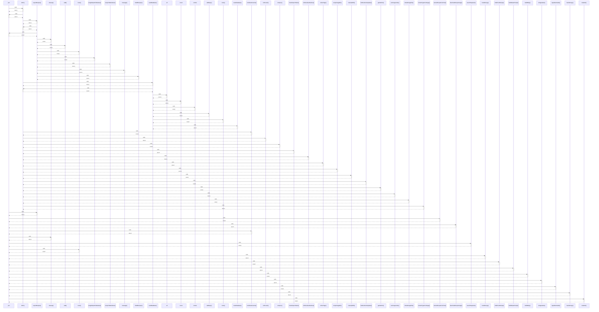

# join

> God node · 17 connections · [C:\Users\ThinkPad\Documents\Claude\Dashboard\web\src\generated\prisma\internal\prismaNamespace.ts](file:///C:/Users/ThinkPad/Documents/Claude/Dashboard/web/src/generated/prisma/internal/prismaNamespace.ts#L52)

## Call Trace Diagram

## Connections by Relation

### calls
- [[GET()]] `INFERRED`
- [[exportRecipes()]] `INFERRED`
- [[extractRecipeFromText()]] `INFERRED`
- [[downloadRecipeImage()]] `INFERRED`
- [[combineAmounts()]] `INFERRED`
- [[cleanup()]] `INFERRED`
- [[searchHaystack()]] `INFERRED`
- [[main()]] `INFERRED`
- [[handleCopy()]] `INFERRED`
- [[draftFromRecipe()]] `INFERRED`
- [[buildIdeasPrompt()]] `INFERRED`
- [[buildBody()]] `INFERRED`
- [[isVegetarian()]] `INFERRED`
- [[ingredientLabel()]] `INFERRED`
- [[handleCopy()]] `INFERRED`
- [[makeDir()]] `INFERRED`

### contains
- [[prismaNamespace.ts]] `EXTRACTED`

---

*Part of the graphify knowledge wiki. See [[index]] to navigate.*