# map

> God node · 37 connections · [C:\Users\ThinkPad\Documents\Claude\Dashboard\web\src\lib\repositories\meals.test.ts](file:///C:/Users/ThinkPad/Documents/Claude/Dashboard/web/src/lib/repositories/meals.test.ts#L212)

## Call Trace Diagram

```mermaid
sequenceDiagram
    participant P0 as map
    participant P1 as generateWeekPlan()
    participant P2 as planDueTasks()
    participant P3 as dayBounds()
    participant P4 as syncCalendarAction()
    participant P5 as main()
    participant P6 as planTask()
    participant P7 as getWeeklyBalances()
    participant P8 as activeDayWindow()
    participant P9 as loadPhaseConfig()
    participant P10 as toEngineTask()
    participant P11 as assignTask()
    participant P12 as generatePlanAction()
    participant P13 as revalidateDashboard()
    participant P14 as getActivePhase()
    participant P15 as sendToAdults()
    participant P16 as getDomeShiftsForWeek()
    participant P17 as deriveDayConstraints()
    participant P18 as ingestVaultIfConfigured()
    participant P19 as weekBoundsOf()
    participant P20 as weightedPick()
    participant P21 as recentRecipeUse()
    participant P22 as candidatesFor()
    participant P23 as add()
    participant P24 as syncIngredientsToShopping()
    participant P25 as combineAmounts()
    participant P26 as getFreshShoppingState()
    participant P27 as mapCurrent()
    participant P28 as getShoppingItems()
    participant P29 as getFreshnessOverrides()
    participant P30 as getNotes()
    participant P31 as configuredCalendars()
    participant P32 as pushRecipeBatch()
    participant P33 as main()
    participant P34 as reduce()
    participant P35 as parseEventTime()
    participant P36 as coveredMs()
    participant P37 as fromLocalDateKey()
    participant P38 as getTodaysEvents()
    participant P39 as replaceWindowEvents()
    participant P40 as getWeekMealPlan()
    participant P41 as getDraftMealPlan()
    participant P42 as getTasksByPerson()
    participant P43 as getTasksForDay()
    participant P44 as buildChoreTasks()
    participant P45 as handleCopy()
    participant P46 as handleCopy()
    participant P47 as handleCopy()
    participant P48 as toBringItems()
    participant P49 as mapForecast()
    participant P50 as toMinutes()
    participant P51 as listOpenTasks()
    participant P52 as constraintsForWeek()
    participant P53 as VaultIngestControl()
    participant P54 as MobileNavBar()
    participant P55 as listRecipes()
    P0->>+ P1: calls
    P1-->>- P0: return
    P1->>+ P0: calls
    P0-->>- P1: return
    P1->>+ P2: semantically_similar_to
    P2-->>- P1: return
    P2->>+ P3: calls
    P3-->>- P2: return
    P2->>+ P1: semantically_similar_to
    P1-->>- P2: return
    P2->>+ P4: calls
    P4-->>- P2: return
    P2->>+ P5: calls
    P5-->>- P2: return
    P2->>+ P6: calls
    P6-->>- P2: return
    P2->>+ P7: calls
    P7-->>- P2: return
    P2->>+ P8: calls
    P8-->>- P2: return
    P2->>+ P9: calls
    P9-->>- P2: return
    P2->>+ P10: calls
    P10-->>- P2: return
    P2->>+ P11: calls
    P11-->>- P2: return
    P1->>+ P12: calls
    P12-->>- P1: return
    P12->>+ P13: calls
    P13-->>- P12: return
    P12->>+ P1: calls
    P1-->>- P12: return
    P12->>+ P14: calls
    P14-->>- P12: return
    P12->>+ P15: calls
    P15-->>- P12: return
    P12->>+ P16: calls
    P16-->>- P12: return
    P12->>+ P17: calls
    P17-->>- P12: return
    P12->>+ P18: calls
    P18-->>- P12: return
    P1->>+ P19: calls
    P19-->>- P1: return
    P1->>+ P20: calls
    P20-->>- P1: return
    P1->>+ P21: calls
    P21-->>- P1: return
    P1->>+ P22: calls
    P22-->>- P1: return
    P1->>+ P23: calls
    P23-->>- P1: return
    P0->>+ P24: calls
    P24-->>- P0: return
    P0->>+ P25: calls
    P25-->>- P0: return
    P0->>+ P26: calls
    P26-->>- P0: return
    P0->>+ P15: calls
    P15-->>- P0: return
    P0->>+ P27: calls
    P27-->>- P0: return
    P0->>+ P28: calls
    P28-->>- P0: return
    P0->>+ P29: calls
    P29-->>- P0: return
    P0->>+ P30: calls
    P30-->>- P0: return
    P0->>+ P31: calls
    P31-->>- P0: return
    P0->>+ P20: calls
    P20-->>- P0: return
    P0->>+ P32: calls
    P32-->>- P0: return
    P0->>+ P33: calls
    P33-->>- P0: return
    P0->>+ P34: calls
    P34-->>- P0: return
    P0->>+ P35: calls
    P35-->>- P0: return
    P0->>+ P36: calls
    P36-->>- P0: return
    P0->>+ P37: calls
    P37-->>- P0: return
    P0->>+ P38: calls
    P38-->>- P0: return
    P0->>+ P39: calls
    P39-->>- P0: return
    P0->>+ P40: calls
    P40-->>- P0: return
    P0->>+ P41: calls
    P41-->>- P0: return
    P0->>+ P42: calls
    P42-->>- P0: return
    P0->>+ P43: calls
    P43-->>- P0: return
    P0->>+ P44: calls
    P44-->>- P0: return
    P0->>+ P17: calls
    P17-->>- P0: return
    P0->>+ P45: calls
    P45-->>- P0: return
    P0->>+ P46: calls
    P46-->>- P0: return
    P0->>+ P47: calls
    P47-->>- P0: return
    P0->>+ P48: calls
    P48-->>- P0: return
    P0->>+ P49: calls
    P49-->>- P0: return
    P0->>+ P50: calls
    P50-->>- P0: return
    P0->>+ P51: calls
    P51-->>- P0: return
    P0->>+ P52: calls
    P52-->>- P0: return
    P0->>+ P53: calls
    P53-->>- P0: return
    P0->>+ P54: calls
    P54-->>- P0: return
    P0->>+ P55: calls
    P55-->>- P0: return
```

## Connections by Relation

### calls
- [[generateWeekPlan()]] `INFERRED`
- [[syncIngredientsToShopping()]] `INFERRED`
- [[combineAmounts()]] `INFERRED`
- [[getFreshShoppingState()]] `INFERRED`
- [[sendToAdults()]] `INFERRED`
- [[mapCurrent()]] `INFERRED`
- [[getShoppingItems()]] `INFERRED`
- [[getFreshnessOverrides()]] `INFERRED`
- [[getNotes()]] `INFERRED`
- [[configuredCalendars()]] `INFERRED`
- [[weightedPick()]] `INFERRED`
- [[pushRecipeBatch()]] `INFERRED`
- [[main()]] `INFERRED`
- [[reduce()]] `INFERRED`
- [[parseEventTime()]] `INFERRED`
- [[coveredMs()]] `INFERRED`
- [[fromLocalDateKey()]] `INFERRED`
- [[getTodaysEvents()]] `INFERRED`
- [[replaceWindowEvents()]] `INFERRED`
- [[getWeekMealPlan()]] `INFERRED`

### contains
- [[meals.test.ts]] `EXTRACTED`

---

*Part of the graphify knowledge wiki. See [[index]] to navigate.*