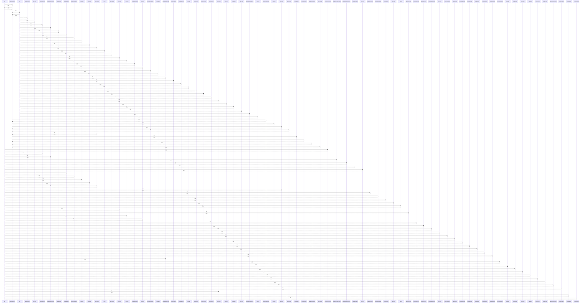

# map

> God node · 48 connections · [C:\Users\ThinkPad\Documents\Claude\Dashboard\web\src\lib\repositories\meals.test.ts](file:///C:/Users/ThinkPad/Documents/Claude/Dashboard/web/src/lib/repositories/meals.test.ts#L209)

## Call Trace Diagram

```mermaid
sequenceDiagram
    participant P0 as map
    participant P1 as toImportedRecipe()
    participant P2 as filter
    participant P3 as getBusyWindows()
    participant P4 as planTask()
    participant P5 as combineAmounts()
    participant P6 as parseExtractionResponse()
    participant P7 as checkWeather()
    participant P8 as ingredientRows()
    participant P9 as configuredCalendars()
    participant P10 as splitSteps()
    participant P11 as draftToInput()
    participant P12 as collectSteps()
    participant P13 as main()
    participant P14 as matchesQuery()
    participant P15 as handleCopy()
    participant P16 as allValues()
    participant P17 as recommendClothing()
    participant P18 as coveredMs()
    participant P19 as listRoutineTemplates()
    participant P20 as parseTags()
    participant P21 as parseIdeasResponse()
    participant P22 as ingredientLabel()
    participant P23 as filterByAvailability()
    participant P24 as dayLoad()
    participant P25 as filterByPerson()
    participant P26 as parseStepsJson()
    participant P27 as learnedInterval()
    participant P28 as coerceIdea()
    participant P29 as applyFilters()
    participant P30 as TodayView()
    participant P31 as toggleTag()
    participant P32 as getActiveProjectProgress()
    participant P33 as mdFiles()
    participant P34 as importRecipeFromUrl()
    participant P35 as stripHtml()
    participant P36 as collectTags()
    participant P37 as slugFromName()
    participant P38 as pickImageUrl()
    participant P39 as parseIsoDuration()
    participant P40 as parseNutritionNumber()
    participant P41 as parseServings()
    participant P42 as upsertImportedRecipe()
    participant P43 as toImportedFromExtraction()
    participant P44 as generateRecipeIdeasAction()
    participant P45 as getDraftMealPlan()
    participant P46 as toRecipe()
    participant P47 as getWeekMealPlan()
    participant P48 as recipeIdeaToImported()
    participant P49 as searchHaystack()
    participant P50 as collectTags()
    participant P51 as main()
    participant P52 as parseEventTime()
    participant P53 as fromLocalDateKey()
    participant P54 as getTodaysEvents()
    participant P55 as replaceWindowEvents()
    participant P56 as listRecipes()
    participant P57 as listRecipeOptions()
    participant P58 as listRecipeTags()
    participant P59 as getTasksByPerson()
    participant P60 as getTasksForDay()
    participant P61 as weightedPick()
    participant P62 as draftFromRecipe()
    participant P63 as buildIdeasPrompt()
    participant P64 as recipeToMarkdown()
    participant P65 as buildBody()
    participant P66 as isVegetarian()
    participant P67 as handleCopy()
    participant P68 as toMinutes()
    participant P69 as listAllRecipes()
    participant P70 as listOpenTasks()
    participant P71 as deleteRoutineTemplate()
    participant P72 as buildChoreTasks()
    participant P73 as MobileNavBar()
    participant P74 as scaleIngredients()
    P0->>+ P1: calls
    P1-->>- P0: return
    P1->>+ P0: calls
    P0-->>- P1: return
    P1->>+ P2: calls
    P2-->>- P1: return
    P2->>+ P1: calls
    P1-->>- P2: return
    P2->>+ P3: calls
    P3-->>- P2: return
    P2->>+ P4: calls
    P4-->>- P2: return
    P2->>+ P5: calls
    P5-->>- P2: return
    P2->>+ P6: calls
    P6-->>- P2: return
    P2->>+ P7: calls
    P7-->>- P2: return
    P2->>+ P8: calls
    P8-->>- P2: return
    P2->>+ P9: calls
    P9-->>- P2: return
    P2->>+ P10: calls
    P10-->>- P2: return
    P2->>+ P11: calls
    P11-->>- P2: return
    P2->>+ P12: calls
    P12-->>- P2: return
    P2->>+ P13: calls
    P13-->>- P2: return
    P2->>+ P14: calls
    P14-->>- P2: return
    P2->>+ P15: calls
    P15-->>- P2: return
    P2->>+ P16: calls
    P16-->>- P2: return
    P2->>+ P17: calls
    P17-->>- P2: return
    P2->>+ P18: calls
    P18-->>- P2: return
    P2->>+ P19: calls
    P19-->>- P2: return
    P2->>+ P20: calls
    P20-->>- P2: return
    P2->>+ P21: calls
    P21-->>- P2: return
    P2->>+ P22: calls
    P22-->>- P2: return
    P2->>+ P23: calls
    P23-->>- P2: return
    P2->>+ P24: calls
    P24-->>- P2: return
    P2->>+ P25: calls
    P25-->>- P2: return
    P2->>+ P26: calls
    P26-->>- P2: return
    P2->>+ P27: calls
    P27-->>- P2: return
    P2->>+ P28: calls
    P28-->>- P2: return
    P2->>+ P29: calls
    P29-->>- P2: return
    P2->>+ P30: calls
    P30-->>- P2: return
    P2->>+ P31: calls
    P31-->>- P2: return
    P2->>+ P32: calls
    P32-->>- P2: return
    P2->>+ P33: calls
    P33-->>- P2: return
    P1->>+ P34: calls
    P34-->>- P1: return
    P1->>+ P35: calls
    P35-->>- P1: return
    P1->>+ P36: calls
    P36-->>- P1: return
    P1->>+ P37: calls
    P37-->>- P1: return
    P1->>+ P12: calls
    P12-->>- P1: return
    P1->>+ P38: calls
    P38-->>- P1: return
    P1->>+ P39: calls
    P39-->>- P1: return
    P1->>+ P40: calls
    P40-->>- P1: return
    P1->>+ P41: calls
    P41-->>- P1: return
    P0->>+ P42: calls
    P42-->>- P0: return
    P0->>+ P5: calls
    P5-->>- P0: return
    P0->>+ P6: calls
    P6-->>- P0: return
    P0->>+ P43: calls
    P43-->>- P0: return
    P0->>+ P44: calls
    P44-->>- P0: return
    P0->>+ P45: calls
    P45-->>- P0: return
    P0->>+ P46: calls
    P46-->>- P0: return
    P0->>+ P8: calls
    P8-->>- P0: return
    P0->>+ P9: calls
    P9-->>- P0: return
    P0->>+ P10: calls
    P10-->>- P0: return
    P0->>+ P11: calls
    P11-->>- P0: return
    P0->>+ P12: calls
    P12-->>- P0: return
    P0->>+ P36: calls
    P36-->>- P0: return
    P0->>+ P47: calls
    P47-->>- P0: return
    P0->>+ P48: calls
    P48-->>- P0: return
    P0->>+ P49: calls
    P49-->>- P0: return
    P0->>+ P50: calls
    P50-->>- P0: return
    P0->>+ P51: calls
    P51-->>- P0: return
    P0->>+ P15: calls
    P15-->>- P0: return
    P0->>+ P52: calls
    P52-->>- P0: return
    P0->>+ P16: calls
    P16-->>- P0: return
    P0->>+ P18: calls
    P18-->>- P0: return
    P0->>+ P53: calls
    P53-->>- P0: return
    P0->>+ P54: calls
    P54-->>- P0: return
    P0->>+ P55: calls
    P55-->>- P0: return
    P0->>+ P56: calls
    P56-->>- P0: return
    P0->>+ P57: calls
    P57-->>- P0: return
    P0->>+ P58: calls
    P58-->>- P0: return
    P0->>+ P59: calls
    P59-->>- P0: return
    P0->>+ P60: calls
    P60-->>- P0: return
    P0->>+ P61: calls
    P61-->>- P0: return
    P0->>+ P62: calls
    P62-->>- P0: return
    P0->>+ P63: calls
    P63-->>- P0: return
    P0->>+ P21: calls
    P21-->>- P0: return
    P0->>+ P64: calls
    P64-->>- P0: return
    P0->>+ P65: calls
    P65-->>- P0: return
    P0->>+ P66: calls
    P66-->>- P0: return
    P0->>+ P67: calls
    P67-->>- P0: return
    P0->>+ P68: calls
    P68-->>- P0: return
    P0->>+ P69: calls
    P69-->>- P0: return
    P0->>+ P70: calls
    P70-->>- P0: return
    P0->>+ P71: calls
    P71-->>- P0: return
    P0->>+ P72: calls
    P72-->>- P0: return
    P0->>+ P28: calls
    P28-->>- P0: return
    P0->>+ P73: calls
    P73-->>- P0: return
    P0->>+ P74: calls
    P74-->>- P0: return
```

## Connections by Relation

### calls
- [[toImportedRecipe()]] `INFERRED`
- [[upsertImportedRecipe()]] `INFERRED`
- [[combineAmounts()]] `INFERRED`
- [[parseExtractionResponse()]] `INFERRED`
- [[toImportedFromExtraction()]] `INFERRED`
- [[generateRecipeIdeasAction()]] `INFERRED`
- [[getDraftMealPlan()]] `INFERRED`
- [[toRecipe()]] `INFERRED`
- [[ingredientRows()]] `INFERRED`
- [[configuredCalendars()]] `INFERRED`
- [[splitSteps()]] `INFERRED`
- [[draftToInput()]] `INFERRED`
- [[collectSteps()]] `INFERRED`
- [[collectTags()]] `INFERRED`
- [[getWeekMealPlan()]] `INFERRED`
- [[recipeIdeaToImported()]] `INFERRED`
- [[searchHaystack()]] `INFERRED`
- [[collectTags()]] `INFERRED`
- [[main()]] `INFERRED`
- [[handleCopy()]] `INFERRED`

### contains
- [[meals.test.ts]] `EXTRACTED`

---

*Part of the graphify knowledge wiki. See [[index]] to navigate.*