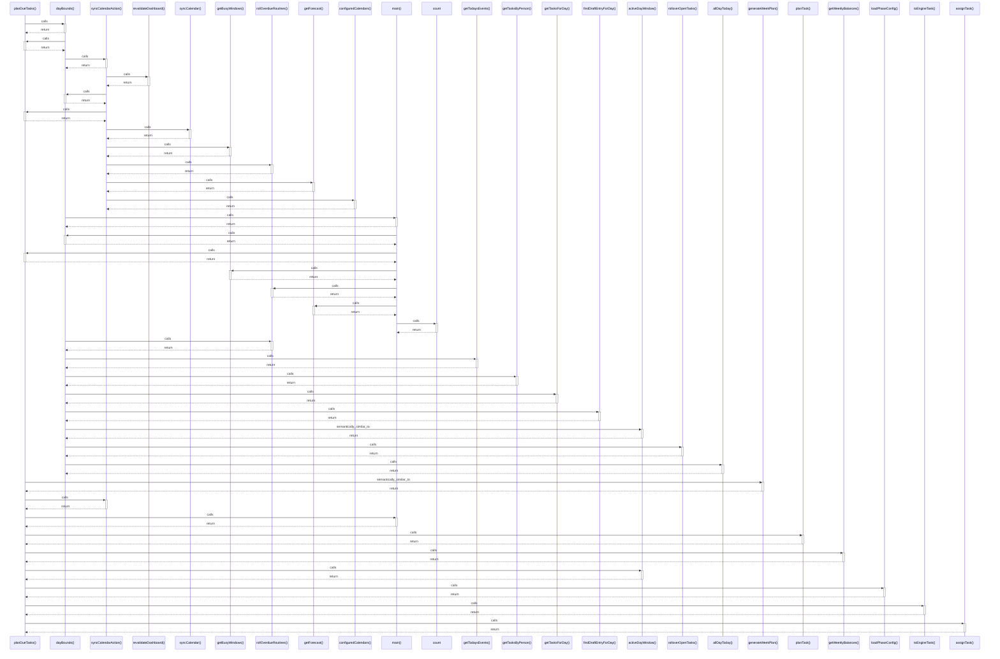

# planDueTasks()

> God node · 11 connections · [C:\Users\ThinkPad\Documents\Claude\Dashboard\web\src\lib\services\planning.ts](file:///C:/Users/ThinkPad/Documents/Claude/Dashboard/web/src/lib/services/planning.ts#L113)

## Call Trace Diagram

## Connections by Relation

### calls
- [[dayBounds()]] `INFERRED`
- [[syncCalendarAction()]] `INFERRED`
- [[main()]] `INFERRED`
- [[planTask()]] `INFERRED`
- [[getWeeklyBalances()]] `INFERRED`
- [[activeDayWindow()]] `INFERRED`
- [[loadPhaseConfig()]] `EXTRACTED`
- [[toEngineTask()]] `EXTRACTED`
- [[assignTask()]] `INFERRED`

### contains
- [[planning.ts]] `EXTRACTED`

### semantically_similar_to
- [[generateWeekPlan()]] `INFERRED`

---

*Part of the graphify knowledge wiki. See [[index]] to navigate.*