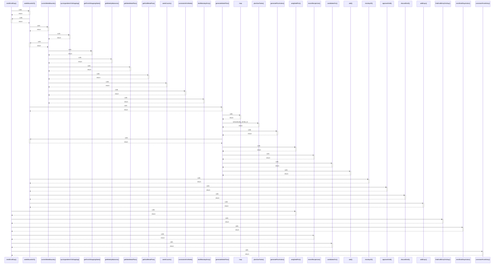

# rerollDraftDay()

> God node · 11 connections · [C:\Users\ThinkPad\Documents\Claude\Dashboard\web\src\lib\services\mealDraft.ts](file:///C:/Users/ThinkPad/Documents/Claude/Dashboard/web/src/lib/services/mealDraft.ts#L67)

## Call Trace Diagram

## Connections by Relation

### calls
- [[weekBoundsOf()]] `INFERRED`
- [[weightedPick()]] `INFERRED`
- [[findDraftEntryForDay()]] `EXTRACTED`
- [[rerollDraftDayAction()]] `INFERRED`
- [[recentRecipeUse()]] `INFERRED`
- [[candidatesFor()]] `INFERRED`
- [[constraintFromEntry()]] `INFERRED`

### conceptually_related_to
- [[generateWeekPlan()]] `INFERRED`
- [[setDraftDayRecipe()]] `INFERRED`
- [[recipeWeight()]] `INFERRED`

### contains
- [[mealDraft.ts]] `EXTRACTED`

---

*Part of the graphify knowledge wiki. See [[index]] to navigate.*