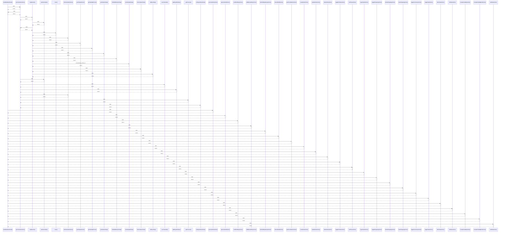

# revalidateDashboard()

> God node · 25 connections · [C:\Users\ThinkPad\Documents\Claude\Dashboard\web\src\lib\revalidate.ts](file:///C:/Users/ThinkPad/Documents/Claude/Dashboard/web/src/lib/revalidate.ts#L17)

## Call Trace Diagram

## Connections by Relation

### calls
- [[syncCalendarAction()]] `INFERRED`
- [[generatePlanAction()]] `INFERRED`
- [[approveDraftAction()]] `INFERRED`
- [[rerollDraftDayAction()]] `INFERRED`
- [[addManualEntryAction()]] `INFERRED`
- [[setDraftDayRecipeAction()]] `INFERRED`
- [[discardDraftAction()]] `INFERRED`
- [[pushFreshBatchAction()]] `INFERRED`
- [[createNoteAction()]] `INFERRED`
- [[updateNoteAction()]] `INFERRED`
- [[deleteNoteAction()]] `INFERRED`
- [[togglePinNoteAction()]] `INFERRED`
- [[setPhaseAction()]] `INFERRED`
- [[ingestVaultAction()]] `INFERRED`
- [[toggleShoppingAction()]] `INFERRED`
- [[deleteShoppingAction()]] `INFERRED`
- [[clearShoppingAction()]] `INFERRED`
- [[toggleFreshnessAction()]] `INFERRED`
- [[toggleTaskAction()]] `INFERRED`
- [[deferTaskAction()]] `INFERRED`

### contains
- [[revalidate.ts]] `EXTRACTED`

---

*Part of the graphify knowledge wiki. See [[index]] to navigate.*