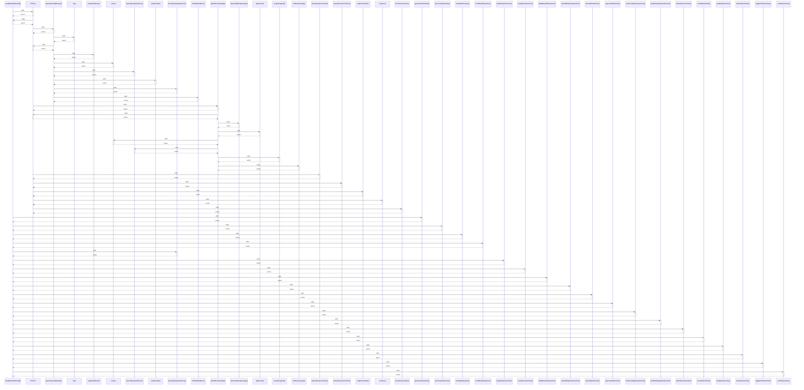

# revalidateDashboard()

> God node · 21 connections · [C:\Users\ThinkPad\Documents\Claude\Dashboard\web\src\lib\revalidate.ts](file:///C:/Users/ThinkPad/Documents/Claude/Dashboard/web/src/lib/revalidate.ts#L19)

## Call Trace Diagram

```mermaid
sequenceDiagram
    participant P0 as revalidateDashboard()
    participant P1 as POST()
    participant P2 as upsertImportedRecipe()
    participant P3 as map
    participant P4 as ingredientRows()
    participant P5 as main()
    participant P6 as importRecipeUrlAction()
    participant P7 as scalarFields()
    participant P8 as acceptRecipeIdeaAction()
    participant P9 as findImportMatch()
    participant P10 as attachRecipeImage()
    participant P11 as downloadRecipeImage()
    participant P12 as getRecipe()
    participant P13 as recipeImageDir()
    participant P14 as setRecipeImage()
    participant P15 as importRecipeFromUrl()
    participant P16 as extractRecipeFromText()
    participant P17 as slugFromName()
    participant P18 as runSync()
    participant P19 as checkImportToken()
    participant P20 as generatePlanAction()
    participant P21 as syncCalendarAction()
    participant P22 as revalidateRecipes()
    participant P23 as rerollDraftDayAction()
    participant P24 as updateRoutineAction()
    participant P25 as createRoutineAction()
    participant P26 as addManualEntryAction()
    participant P27 as setDraftDayRecipeAction()
    participant P28 as discardDraftAction()
    participant P29 as approveDraftAction()
    participant P30 as setActiveDayRecipeAction()
    participant P31 as pushMealIngredientsAction()
    participant P32 as deleteRoutineAction()
    participant P33 as createNoteAction()
    participant P34 as updateNoteAction()
    participant P35 as deleteNoteAction()
    participant P36 as togglePinNoteAction()
    participant P37 as setPhaseAction()
    P0->>+ P1: calls
    P1-->>- P0: return
    P1->>+ P0: calls
    P0-->>- P1: return
    P1->>+ P2: calls
    P2-->>- P1: return
    P2->>+ P3: calls
    P3-->>- P2: return
    P2->>+ P1: calls
    P1-->>- P2: return
    P2->>+ P4: calls
    P4-->>- P2: return
    P2->>+ P5: calls
    P5-->>- P2: return
    P2->>+ P6: calls
    P6-->>- P2: return
    P2->>+ P7: calls
    P7-->>- P2: return
    P2->>+ P8: calls
    P8-->>- P2: return
    P2->>+ P9: calls
    P9-->>- P2: return
    P1->>+ P10: calls
    P10-->>- P1: return
    P10->>+ P1: calls
    P1-->>- P10: return
    P10->>+ P11: calls
    P11-->>- P10: return
    P10->>+ P12: calls
    P12-->>- P10: return
    P10->>+ P5: calls
    P5-->>- P10: return
    P10->>+ P6: calls
    P6-->>- P10: return
    P10->>+ P13: calls
    P13-->>- P10: return
    P10->>+ P14: calls
    P14-->>- P10: return
    P1->>+ P15: calls
    P15-->>- P1: return
    P1->>+ P16: calls
    P16-->>- P1: return
    P1->>+ P17: calls
    P17-->>- P1: return
    P1->>+ P18: calls
    P18-->>- P1: return
    P1->>+ P19: calls
    P19-->>- P1: return
    P0->>+ P20: calls
    P20-->>- P0: return
    P0->>+ P21: calls
    P21-->>- P0: return
    P0->>+ P22: calls
    P22-->>- P0: return
    P0->>+ P23: calls
    P23-->>- P0: return
    P0->>+ P8: calls
    P8-->>- P0: return
    P0->>+ P24: calls
    P24-->>- P0: return
    P0->>+ P25: calls
    P25-->>- P0: return
    P0->>+ P26: calls
    P26-->>- P0: return
    P0->>+ P27: calls
    P27-->>- P0: return
    P0->>+ P28: calls
    P28-->>- P0: return
    P0->>+ P29: calls
    P29-->>- P0: return
    P0->>+ P30: calls
    P30-->>- P0: return
    P0->>+ P31: calls
    P31-->>- P0: return
    P0->>+ P32: calls
    P32-->>- P0: return
    P0->>+ P33: calls
    P33-->>- P0: return
    P0->>+ P34: calls
    P34-->>- P0: return
    P0->>+ P35: calls
    P35-->>- P0: return
    P0->>+ P36: calls
    P36-->>- P0: return
    P0->>+ P37: calls
    P37-->>- P0: return
```

## Connections by Relation

### calls
- [[POST()]] `INFERRED`
- [[generatePlanAction()]] `INFERRED`
- [[syncCalendarAction()]] `INFERRED`
- [[revalidateRecipes()]] `INFERRED`
- [[rerollDraftDayAction()]] `INFERRED`
- [[acceptRecipeIdeaAction()]] `INFERRED`
- [[updateRoutineAction()]] `INFERRED`
- [[createRoutineAction()]] `INFERRED`
- [[addManualEntryAction()]] `INFERRED`
- [[setDraftDayRecipeAction()]] `INFERRED`
- [[discardDraftAction()]] `INFERRED`
- [[approveDraftAction()]] `INFERRED`
- [[setActiveDayRecipeAction()]] `INFERRED`
- [[pushMealIngredientsAction()]] `INFERRED`
- [[deleteRoutineAction()]] `INFERRED`
- [[createNoteAction()]] `INFERRED`
- [[updateNoteAction()]] `INFERRED`
- [[deleteNoteAction()]] `INFERRED`
- [[togglePinNoteAction()]] `INFERRED`
- [[setPhaseAction()]] `INFERRED`

### contains
- [[revalidate.ts]] `EXTRACTED`

---

*Part of the graphify knowledge wiki. See [[index]] to navigate.*