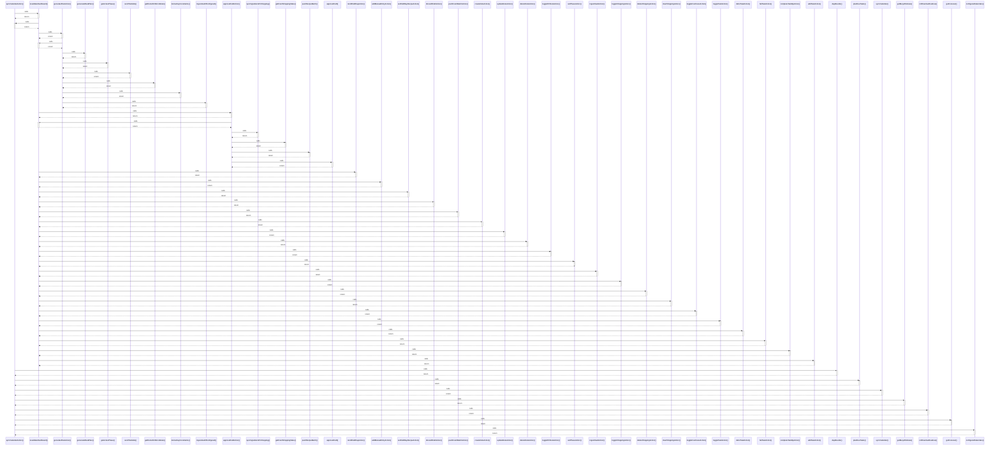

# syncCalendarAction()

> God node · 9 connections · [C:\Users\ThinkPad\Documents\Claude\Dashboard\web\src\app\actions\calendar.ts](file:///C:/Users/ThinkPad/Documents/Claude/Dashboard/web/src/app/actions/calendar.ts#L16)

## Call Trace Diagram

## Connections by Relation

### calls
- [[revalidateDashboard()]] `INFERRED`
- [[dayBounds()]] `INFERRED`
- [[planDueTasks()]] `INFERRED`
- [[syncCalendar()]] `INFERRED`
- [[getBusyWindows()]] `INFERRED`
- [[rollOverdueRoutines()]] `INFERRED`
- [[getForecast()]] `INFERRED`
- [[configuredCalendars()]] `INFERRED`

### contains
- [[calendar.ts]] `EXTRACTED`

---

*Part of the graphify knowledge wiki. See [[index]] to navigate.*