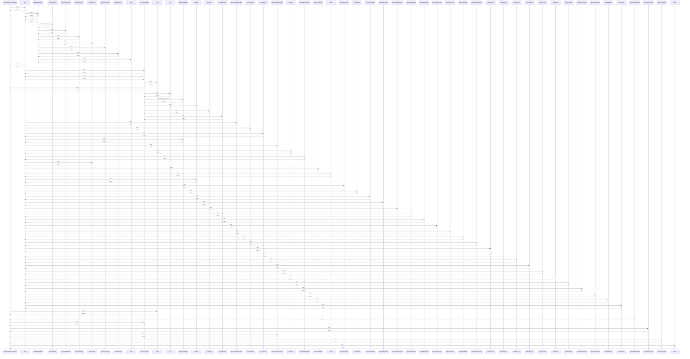

# syncIngredientsToShopping()

> God node · 10 connections · [C:\Users\ThinkPad\Documents\Claude\Dashboard\web\src\lib\services\shoppingSync.ts](file:///C:/Users/ThinkPad/Documents/Claude/Dashboard/web/src/lib/services/shoppingSync.ts#L29)

## Call Trace Diagram

## Connections by Relation

### calls
- [[map]] `INFERRED`
- [[GET()]] `INFERRED`
- [[currentWeekBounds()]] `INFERRED`
- [[combineAmounts()]] `INFERRED`
- [[approveDraftAction()]] `INFERRED`
- [[getFreshnessOverrides()]] `INFERRED`
- [[resolveFreshness()]] `INFERRED`
- [[main()]] `INFERRED`

### contains
- [[shoppingSync.ts]] `EXTRACTED`

### shares_data_with
- [[pushRecipeBatch()]] `INFERRED`

---

*Part of the graphify knowledge wiki. See [[index]] to navigate.*