# toImportedRecipe()

> God node · 12 connections · [C:\Users\ThinkPad\Documents\Claude\Dashboard\web\src\lib\services\recipeImport.ts](file:///C:/Users/ThinkPad/Documents/Claude/Dashboard/web/src/lib/services/recipeImport.ts#L479)

## Call Trace Diagram

```mermaid
sequenceDiagram
    participant P0 as toImportedRecipe()
    participant P1 as map
    participant P2 as upsertImportedRecipe()
    participant P3 as POST()
    participant P4 as ingredientRows()
    participant P5 as main()
    participant P6 as importRecipeUrlAction()
    participant P7 as scalarFields()
    participant P8 as acceptRecipeIdeaAction()
    participant P9 as findImportMatch()
    participant P10 as combineAmounts()
    participant P11 as filter
    participant P12 as GET()
    participant P13 as join
    participant P14 as formatNumber()
    participant P15 as withUnit()
    participant P16 as parseExtractionResponse()
    participant P17 as toImportedFromExtraction()
    participant P18 as generateRecipeIdeasAction()
    participant P19 as getDraftMealPlan()
    participant P20 as toRecipe()
    participant P21 as configuredCalendars()
    participant P22 as splitSteps()
    participant P23 as draftToInput()
    participant P24 as collectSteps()
    participant P25 as collectTags()
    participant P26 as getWeekMealPlan()
    participant P27 as recipeIdeaToImported()
    participant P28 as searchHaystack()
    participant P29 as collectTags()
    participant P30 as main()
    participant P31 as handleCopy()
    participant P32 as parseEventTime()
    participant P33 as allValues()
    participant P34 as coveredMs()
    participant P35 as fromLocalDateKey()
    participant P36 as getTodaysEvents()
    participant P37 as replaceWindowEvents()
    participant P38 as listRecipes()
    participant P39 as listRecipeOptions()
    participant P40 as listRecipeTags()
    participant P41 as getTasksByPerson()
    participant P42 as getTasksForDay()
    participant P43 as weightedPick()
    participant P44 as draftFromRecipe()
    participant P45 as buildIdeasPrompt()
    participant P46 as parseIdeasResponse()
    participant P47 as recipeToMarkdown()
    participant P48 as buildBody()
    participant P49 as isVegetarian()
    participant P50 as handleCopy()
    participant P51 as toMinutes()
    participant P52 as listAllRecipes()
    participant P53 as listOpenTasks()
    participant P54 as deleteRoutineTemplate()
    participant P55 as buildChoreTasks()
    participant P56 as coerceIdea()
    participant P57 as MobileNavBar()
    participant P58 as scaleIngredients()
    participant P59 as importRecipeFromUrl()
    participant P60 as stripHtml()
    participant P61 as slugFromName()
    participant P62 as pickImageUrl()
    participant P63 as parseIsoDuration()
    participant P64 as parseNutritionNumber()
    participant P65 as parseServings()
    P0->>+ P1: calls
    P1-->>- P0: return
    P1->>+ P0: calls
    P0-->>- P1: return
    P1->>+ P2: calls
    P2-->>- P1: return
    P2->>+ P1: calls
    P1-->>- P2: return
    P2->>+ P3: calls
    P3-->>- P2: return
    P2->>+ P4: calls
    P4-->>- P2: return
    P2->>+ P5: calls
    P5-->>- P2: return
    P2->>+ P6: calls
    P6-->>- P2: return
    P2->>+ P7: calls
    P7-->>- P2: return
    P2->>+ P8: calls
    P8-->>- P2: return
    P2->>+ P9: calls
    P9-->>- P2: return
    P1->>+ P10: calls
    P10-->>- P1: return
    P10->>+ P1: calls
    P1-->>- P10: return
    P10->>+ P11: calls
    P11-->>- P10: return
    P10->>+ P12: calls
    P12-->>- P10: return
    P10->>+ P13: calls
    P13-->>- P10: return
    P10->>+ P14: calls
    P14-->>- P10: return
    P10->>+ P15: calls
    P15-->>- P10: return
    P1->>+ P16: calls
    P16-->>- P1: return
    P1->>+ P17: calls
    P17-->>- P1: return
    P1->>+ P18: calls
    P18-->>- P1: return
    P1->>+ P19: calls
    P19-->>- P1: return
    P1->>+ P20: calls
    P20-->>- P1: return
    P1->>+ P4: calls
    P4-->>- P1: return
    P1->>+ P21: calls
    P21-->>- P1: return
    P1->>+ P22: calls
    P22-->>- P1: return
    P1->>+ P23: calls
    P23-->>- P1: return
    P1->>+ P24: calls
    P24-->>- P1: return
    P1->>+ P25: calls
    P25-->>- P1: return
    P1->>+ P26: calls
    P26-->>- P1: return
    P1->>+ P27: calls
    P27-->>- P1: return
    P1->>+ P28: calls
    P28-->>- P1: return
    P1->>+ P29: calls
    P29-->>- P1: return
    P1->>+ P30: calls
    P30-->>- P1: return
    P1->>+ P31: calls
    P31-->>- P1: return
    P1->>+ P32: calls
    P32-->>- P1: return
    P1->>+ P33: calls
    P33-->>- P1: return
    P1->>+ P34: calls
    P34-->>- P1: return
    P1->>+ P35: calls
    P35-->>- P1: return
    P1->>+ P36: calls
    P36-->>- P1: return
    P1->>+ P37: calls
    P37-->>- P1: return
    P1->>+ P38: calls
    P38-->>- P1: return
    P1->>+ P39: calls
    P39-->>- P1: return
    P1->>+ P40: calls
    P40-->>- P1: return
    P1->>+ P41: calls
    P41-->>- P1: return
    P1->>+ P42: calls
    P42-->>- P1: return
    P1->>+ P43: calls
    P43-->>- P1: return
    P1->>+ P44: calls
    P44-->>- P1: return
    P1->>+ P45: calls
    P45-->>- P1: return
    P1->>+ P46: calls
    P46-->>- P1: return
    P1->>+ P47: calls
    P47-->>- P1: return
    P1->>+ P48: calls
    P48-->>- P1: return
    P1->>+ P49: calls
    P49-->>- P1: return
    P1->>+ P50: calls
    P50-->>- P1: return
    P1->>+ P51: calls
    P51-->>- P1: return
    P1->>+ P52: calls
    P52-->>- P1: return
    P1->>+ P53: calls
    P53-->>- P1: return
    P1->>+ P54: calls
    P54-->>- P1: return
    P1->>+ P55: calls
    P55-->>- P1: return
    P1->>+ P56: calls
    P56-->>- P1: return
    P1->>+ P57: calls
    P57-->>- P1: return
    P1->>+ P58: calls
    P58-->>- P1: return
    P0->>+ P11: calls
    P11-->>- P0: return
    P0->>+ P59: calls
    P59-->>- P0: return
    P0->>+ P60: calls
    P60-->>- P0: return
    P0->>+ P25: calls
    P25-->>- P0: return
    P0->>+ P61: calls
    P61-->>- P0: return
    P0->>+ P24: calls
    P24-->>- P0: return
    P0->>+ P62: calls
    P62-->>- P0: return
    P0->>+ P63: calls
    P63-->>- P0: return
    P0->>+ P64: calls
    P64-->>- P0: return
    P0->>+ P65: calls
    P65-->>- P0: return
```

## Connections by Relation

### calls
- [[map]] `INFERRED`
- [[filter]] `INFERRED`
- [[importRecipeFromUrl()]] `EXTRACTED`
- [[stripHtml()]] `EXTRACTED`
- [[collectTags()]] `EXTRACTED`
- [[slugFromName()]] `EXTRACTED`
- [[collectSteps()]] `EXTRACTED`
- [[pickImageUrl()]] `EXTRACTED`
- [[parseIsoDuration()]] `EXTRACTED`
- [[parseNutritionNumber()]] `EXTRACTED`
- [[parseServings()]] `EXTRACTED`

### contains
- [[recipeImport.ts]] `EXTRACTED`

---

*Part of the graphify knowledge wiki. See [[index]] to navigate.*